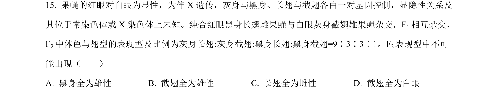
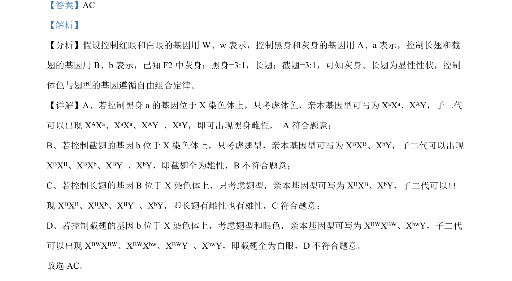

## 题面

## 摘要

考查伴性遗传与自由组合定律的应用，以及茉莉酸信号转导和嫁接实验分析

## 关联考点

- [[276-伴性遗传|伴性遗传]]
- [[272-自由组合定律|自由组合定律]]
- [[植物激素信号转导]]
- [[915-嫁接实验|嫁接实验]]

## 答案与解析

> 📄 原 PDF 第 11 页：`素材/真题/湖南/2008-2024·（湖南）生物高考真题/2022年高考生物试卷（湖南）（解析卷）.pdf`
