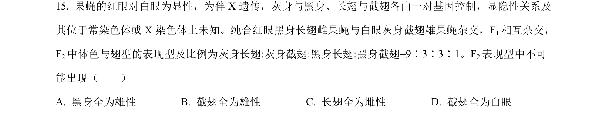
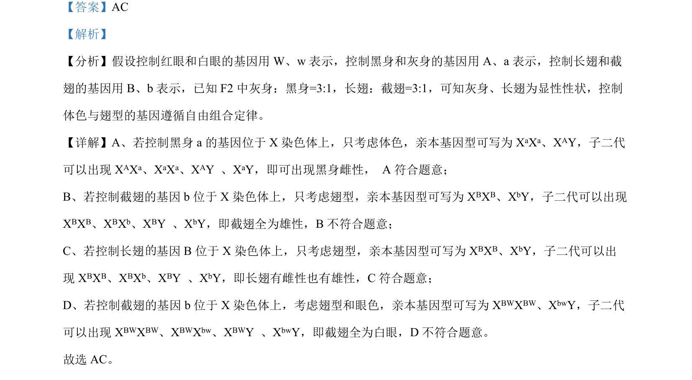

## 题面

## 摘要

考查伴性遗传与自由组合定律的应用，以及茉莉酸信号转导和嫁接实验分析

## 关联考点

- [[276-伴性遗传|伴性遗传]]
- [[272-自由组合定律|自由组合定律]]
- [[植物激素信号转导]]
- [[915-嫁接实验|嫁接实验]]

## 答案与解析

> 📄 原 PDF 第 11 页：`素材/真题/湖南/2008-2024·（湖南）生物高考真题/2022年高考生物试卷（湖南）（解析卷）.pdf`

<!-- 题干文本-start -->
## 题干文本
15. 果蝇的红眼对白眼为显性，为伴 X 遗传，灰身与黑身、长翅与截翅各由一对基因控制，显隐性关系及
其位于常染色体或 X 染色体上未知。纯合红眼黑身长翅雌果蝇与白眼灰身截翅雄果蝇杂交，F1相互杂交，
F2中体色与翅型的表现型及比例为灰身长翅:灰身截翅:黑身长翅:黑身截翅=9∶3∶3∶1。F2表现型中不可
能出现（　　）
A. 黑身全为雄性 B. 截翅全为雄性 C. 长翅全为雌性 D. 截翅全为白眼
<!-- 题干文本-end -->

<!-- 解析文本-start -->
## 解析文本
【答案】AC
【解析】
【分析】假设控制红眼和白眼的基因用 W、w 表示，控制黑身和灰身的基因用 A、a表示，控制长翅和截
翅的基因用 B、b表示，已知 F2 中灰身：黑身=3:1，长翅：截翅=3:1，可知灰身、长翅为显性性状，控制
体色与翅型的基因遵循自由组合定律。
【详解】A、若控制黑身 a的基因位于 X 染色体上，只考虑体色，亲本基因型可写为 XaXa、XAY，子二代
可以出现 XAXa、XaXa、XAY 、XaY，即可出现黑身雌性， A 符合题意；
B、若控制截翅的基因 b 位于 X 染色体上，只考虑翅型，亲本基因型可写为 XBXB、XbY，子二代可以出现
XBXB、XBXb、XBY 、XbY，即截翅全为雄性，B不符合题意；
C、若控制长翅 基因 B位于 X 染色体上，只考虑翅型，亲本基因型可写为 XBXB、XbY，子二代可以出
现 XBXB、XBXb、XBY 、XbY，即长翅有雌性也有雄性，C符合题意；
D、若控制截翅的基因 b 位于 X 染色体上，考虑翅型和眼色，亲本基因型可写为 XBWXBW、XbwY，子二代
可以出现 XBWXBW、XBWXbw、XBWY 、XbwY，即截翅全为白眼，D 不符合题意。
故选 AC。
<!-- 解析文本-end -->
