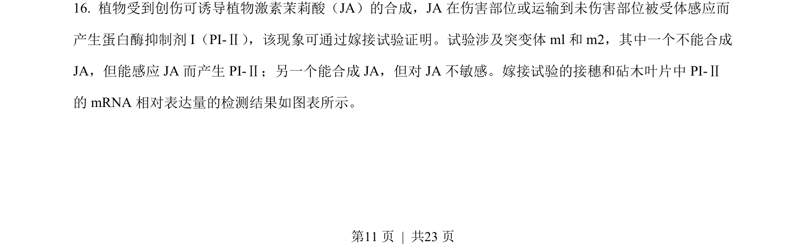
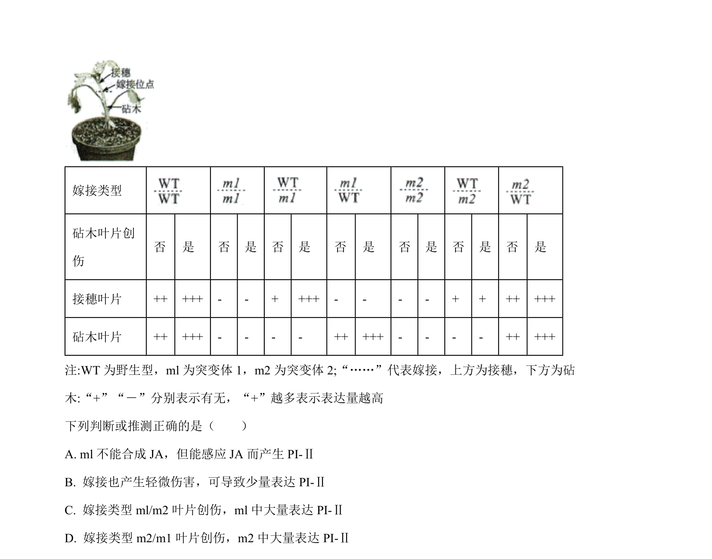
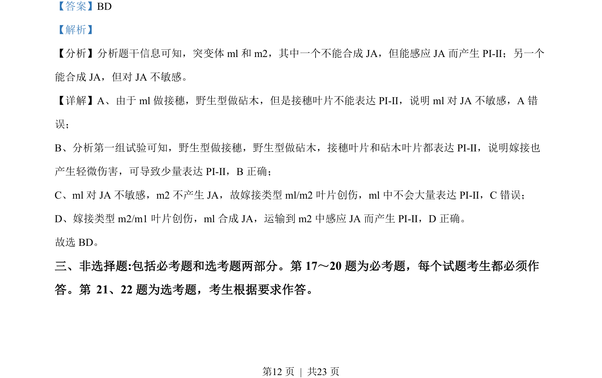
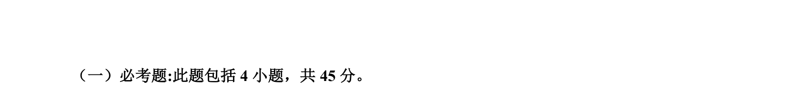

## 题面

## 摘要

考查植物激素JA信号转导的嫁接实验分析，及水稻种子萌发、光补偿点和光周期对开花的影响。

## 关联考点

- [[JA信号转导]]
- [[915-嫁接实验|嫁接实验]]
- [[光补偿点]]
- [[760-光周期|光周期]]
- [[种子萌发条件]]

## 答案与解析

> 📄 原 PDF 第 11 页：`素材/真题/湖南/2008-2024·（湖南）生物高考真题/2022年高考生物试卷（湖南）（解析卷）.pdf`
