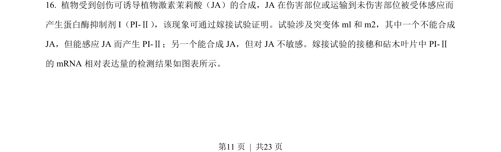
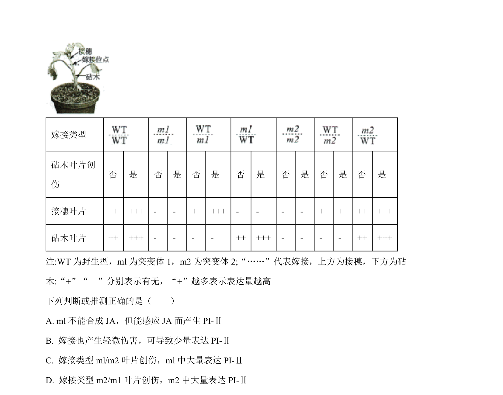
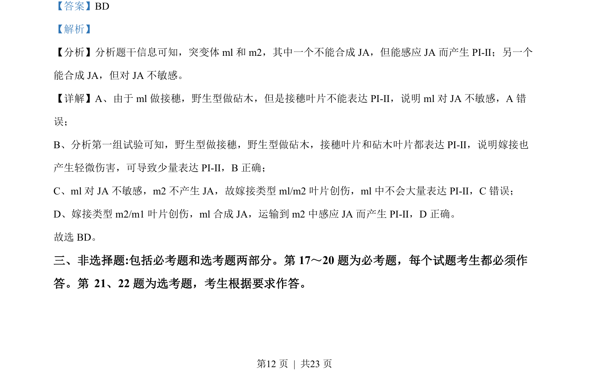

## 题面

## 摘要

考查植物激素JA信号转导的嫁接实验分析，及水稻种子萌发、光补偿点和光周期对开花的影响。

## 关联考点

- [[JA信号转导]]
- [[915-嫁接实验|嫁接实验]]
- [[光补偿点]]
- [[760-光周期|光周期]]
- [[种子萌发条件]]

## 答案与解析

> 📄 原 PDF 第 11 页：`素材/真题/湖南/2008-2024·（湖南）生物高考真题/2022年高考生物试卷（湖南）（解析卷）.pdf`

<!-- 题干文本-start -->
## 题干文本
16. 植物受到创伤可诱导植物激素茉莉酸（JA）的合成，JA 在伤害部位或运输到未伤害部位被受体感应而
产生蛋白酶抑制剂 I（PI-Ⅱ） ，该现象可通过嫁接试验证明。试验涉及突变体ml和 m2，其中一个不能合成
JA，但能感应 JA 而产生 PI-Ⅱ；另一个能合成 JA，但对 JA 不敏感。嫁接试验的接穗和砧木叶片中 PI-Ⅱ
的 mRNA 相对表达量的检测结果如图表所示。
的
<!-- 题干文本-end -->

<!-- 解析文本-start -->
## 解析文本

<!-- 解析文本-end -->
