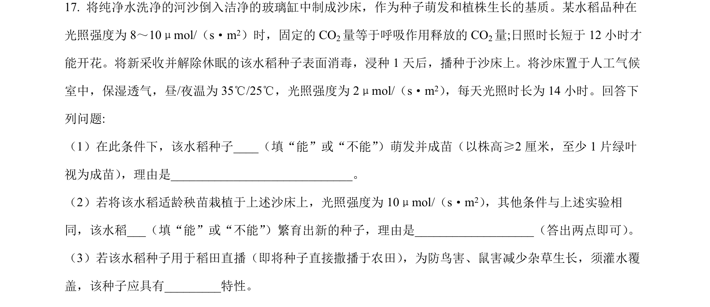
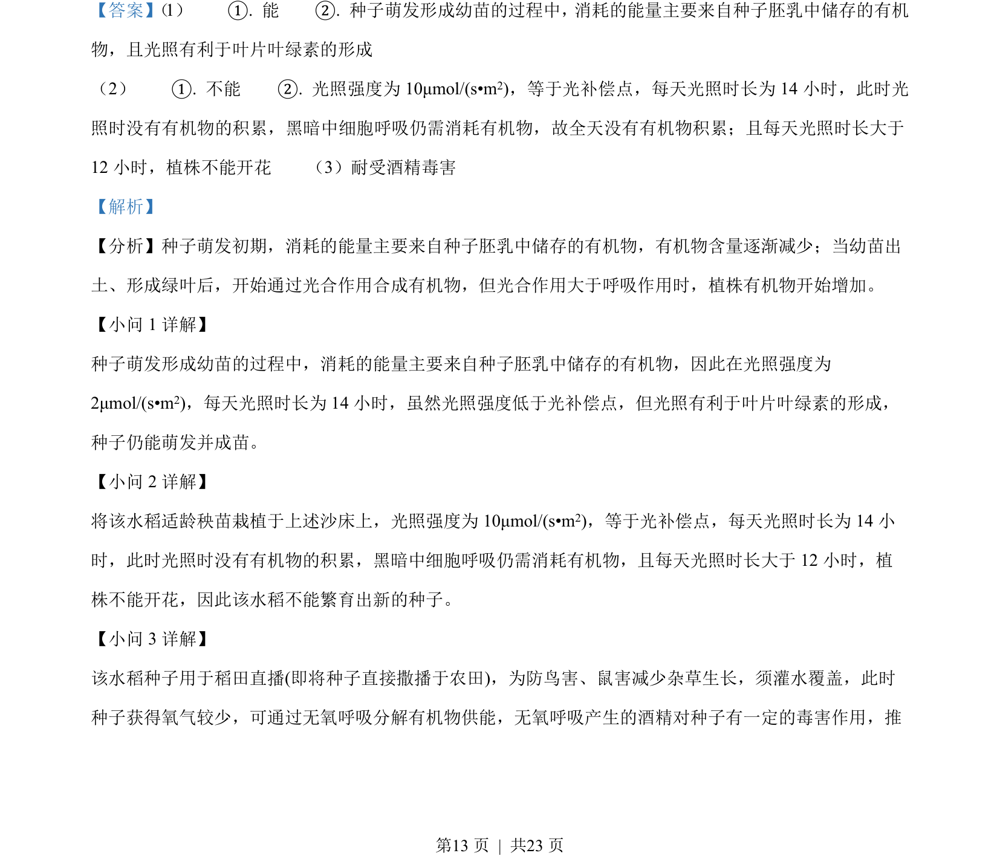

## 题面

## 摘要

考查种子萌发物质能量变化、光补偿点与生殖生长、无氧呼吸及酒精耐受，以及体温调节的散热方式、调定点与探究实验。

## 关联考点

- [[015-种子萌发|种子萌发]]
- [[241-细胞呼吸|细胞呼吸]]
- [[542-体温调节|体温调节]]
- [[482-实验设计|实验设计]]

## 答案与解析

> 📄 原 PDF 第 13 页：`素材/真题/湖南/2008-2024·（湖南）生物高考真题/2022年高考生物试卷（湖南）（解析卷）.pdf`
