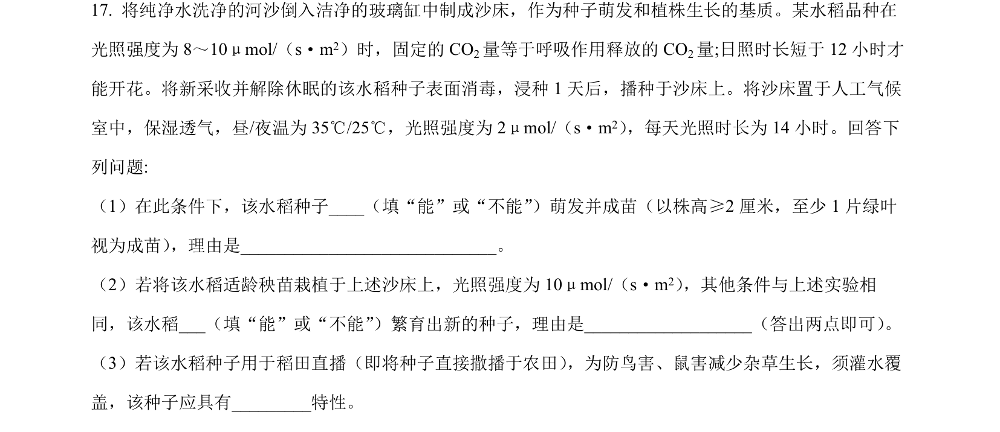
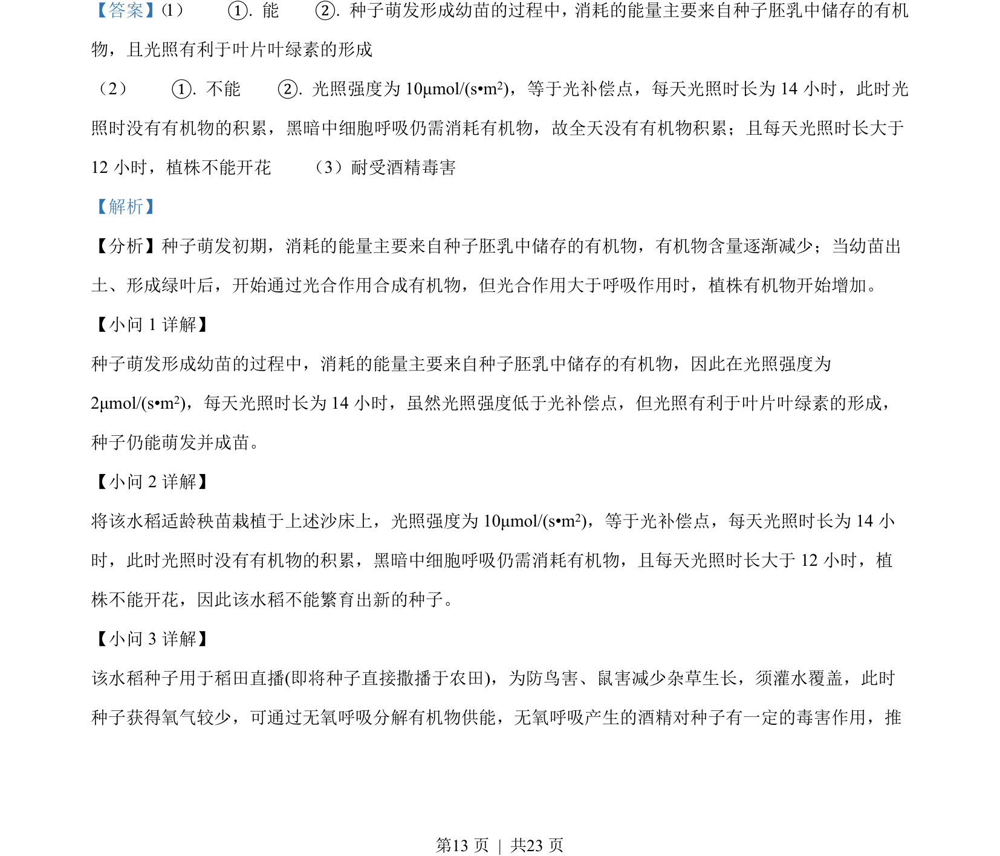

## 题面

## 摘要

考查种子萌发物质能量变化、光补偿点与生殖生长、无氧呼吸及酒精耐受，以及体温调节的散热方式、调定点与探究实验。

## 关联考点

- [[015-种子萌发|种子萌发]]
- [[241-细胞呼吸|细胞呼吸]]
- [[542-体温调节|体温调节]]
- [[482-实验设计|实验设计]]

## 答案与解析

> 📄 原 PDF 第 13 页：`素材/真题/湖南/2008-2024·（湖南）生物高考真题/2022年高考生物试卷（湖南）（解析卷）.pdf`

<!-- 题干文本-start -->
## 题干文本
17. 将纯净水洗净的河沙倒入洁净的玻璃缸中制成沙床，作为种子萌发和植株生长的基质。某水稻品种在
光照强度为 8～10μmol/（s·m2）时，固定的 CO2量等于呼吸作用释放的 CO2量;日照时长短于 12 小时才
能开花。将新采收并解除休眠的该水稻种子表面消毒，浸种 1 天后，播种于沙床上。将沙床置于人工气候
室中，保湿透气，昼/夜温为 35℃/25℃，光照强度为 2μmol/（s·m2） ，每天光照时长为14 小时。回答下
列问题:
（1）在此条件下，该水稻种子____（填“能”或“不能”）萌发并成苗（以株高≥2 厘米，至少 1 片绿叶
视为成苗） ，理由是_____________________________。
（2）若将该水稻适龄秧苗栽植于上述沙床上，光照强度为 10μmol/（s·m2） ，其他条件与上述实验相
同，该水稻___（填“能”或“不能”）繁育出新的种子，理由是___________________（答出两点即可） 。
（3）若该水稻种子用于稻田直播（即将种子直接撒播于农田） ，为防鸟害、鼠害减少杂草生长，须灌水覆
盖，该种子应具有_________特性。
<!-- 题干文本-end -->

<!-- 解析文本-start -->
## 解析文本
【答案】 （1）    ①. 能    ②. 种子萌发形成幼苗的过程中， 消耗的能量主要来自种子胚乳中储存的有机
物，且光照有利于叶片叶绿素的形成    
（2）    ①. 不能    ②. 光照强度为 10μmol/(s•m2)，等于光补偿点，每天光照时长为 14 小时，此时光
照时没有有机物的积累，黑暗中细胞呼吸仍需消耗有机物，故全天没有有机物积累；且每天光照时长大于
12 小时，植株不能开花    （3）耐受酒精毒害
【解析】
【分析】种子萌发初期，消耗的能量主要来自种子胚乳中储存的有机物，有机物含量逐渐减少；当幼苗出
土、形成绿叶后，开始通过光合作用合成有机物，但光合作用大于呼吸作用时，植株有机物开始增加。
【小问 1 详解】
种子萌发形成幼苗的过程中，消耗的能量主要来自种子胚乳中储存的有机物，因此在光照强度为
2μmol/(s•m2)，每天光照时长为 14 小时，虽然光照强度低于光补偿点，但光照有利于叶片叶绿素的形成，
种子仍能萌发并成苗。
【小问 2 详解】
将该水稻适龄秧苗栽植于上述沙床上，光照强度为 10μmol/(s•m2)，等于光补偿点，每天光照时长为 14 小
时，此时光照时没有有机物的积累，黑暗中细胞呼吸仍需消耗有机物，且每天光照时长大于 12 小时，植
株不能开花，因此该水稻不能繁育出新的种子。
【小问 3 详解】
该水稻种子用于稻田直播(即将种子直接撒播于农田)，为防鸟害、鼠害减少杂草生长，须灌水覆盖，此时
种子获得氧气较少，可通过无氧呼吸分解有机物供能，无氧呼吸产生的酒精对种子有一定的毒害作用，推
<!-- 解析文本-end -->
