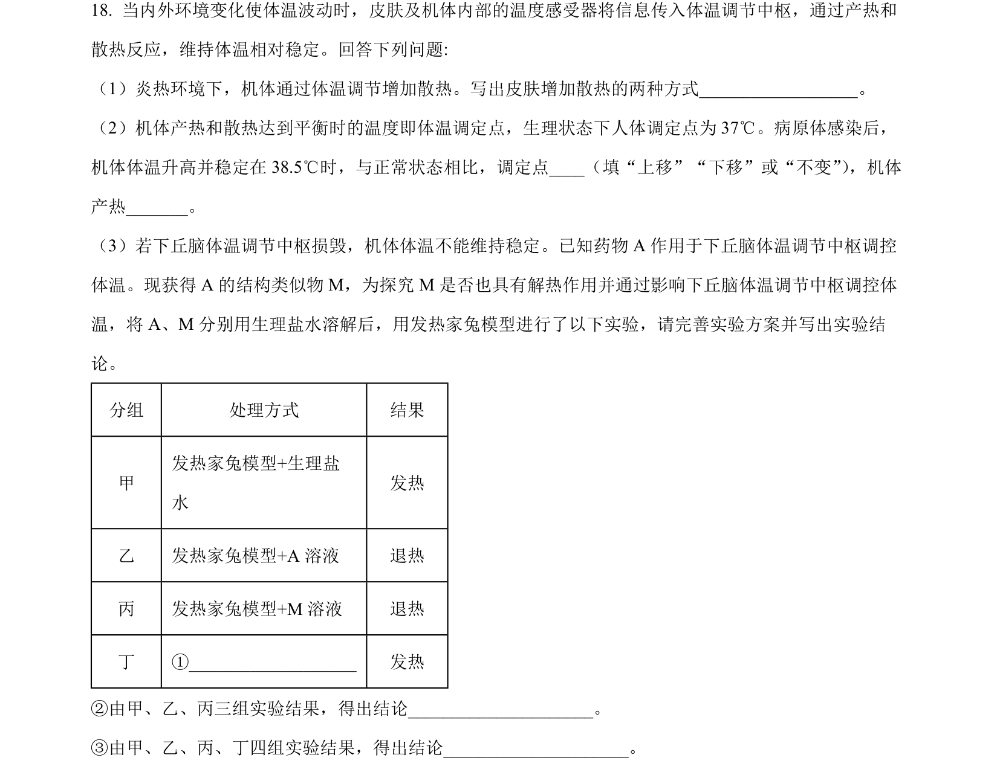
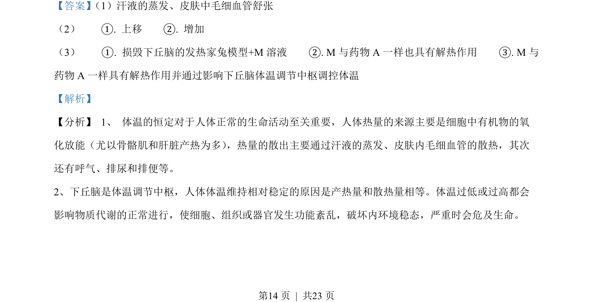
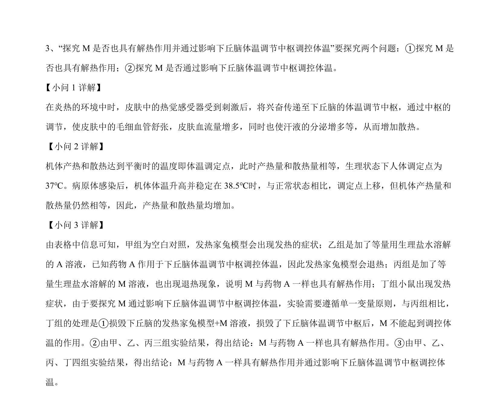

## 题面

## 摘要

该题考查体温调节机制探究实验设计与遗传规律应用，涉及基因突变、电泳分析和显隐性判断。

## 关联考点

- [[542-体温调节|体温调节]]
- [[482-实验设计|实验设计]]
- [[301-基因突变|基因突变]]
- [[477-基因分离定律|基因分离定律]]
- [[限制酶电泳]]
- [[610-显隐性判断|显隐性判断]]

## 答案与解析

> 📄 原 PDF 第 14 页：`素材/真题/湖南/2008-2024·（湖南）生物高考真题/2022年高考生物试卷（湖南）（解析卷）.pdf`
