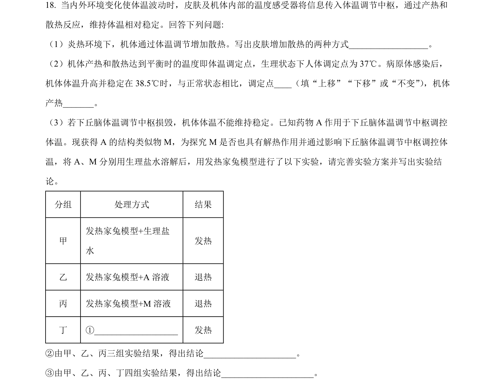
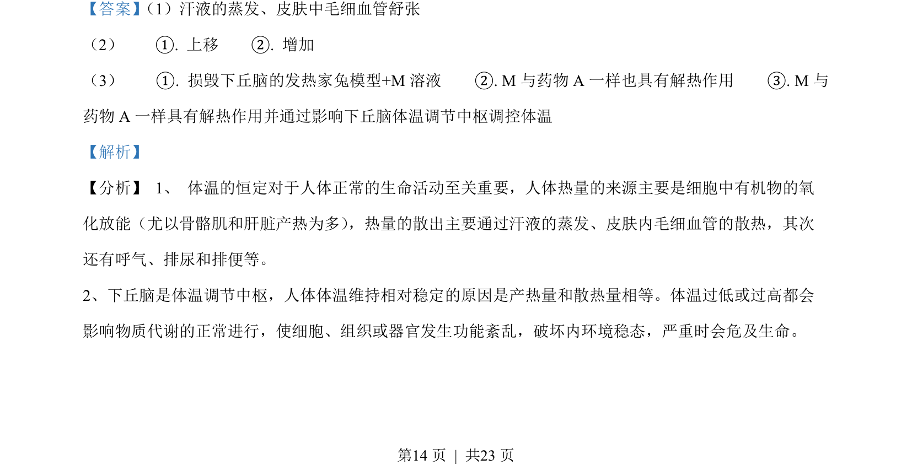
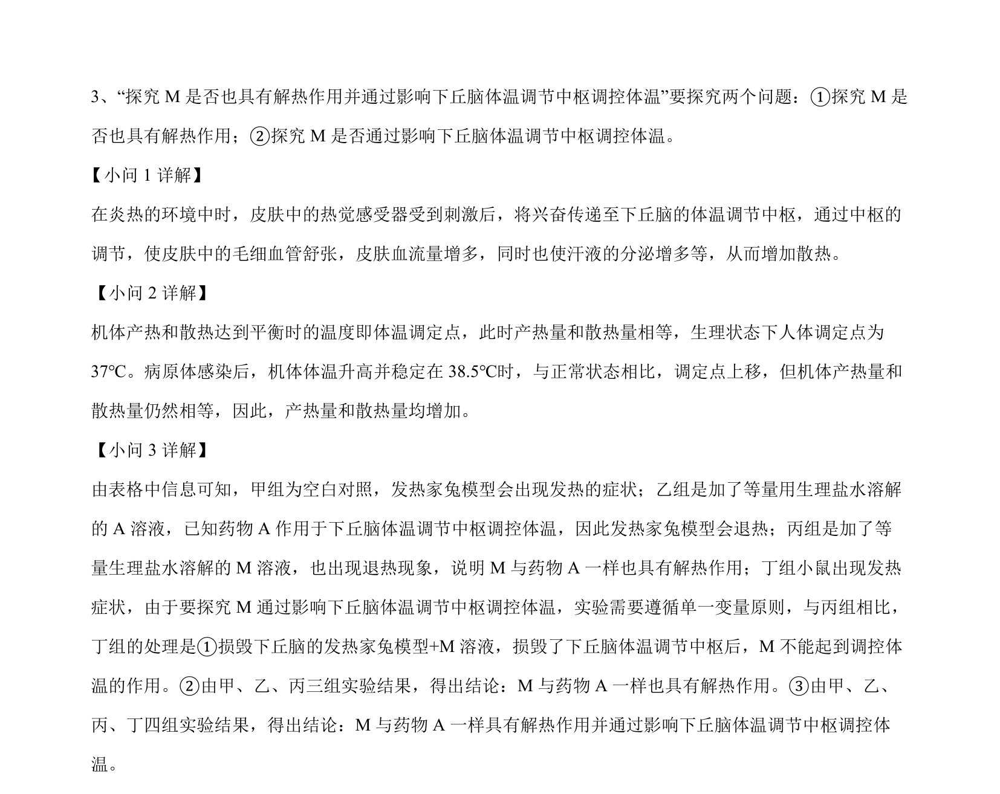

## 题面

## 摘要

该题考查体温调节机制探究实验设计与遗传规律应用，涉及基因突变、电泳分析和显隐性判断。

## 关联考点

- [[542-体温调节|体温调节]]
- [[482-实验设计|实验设计]]
- [[301-基因突变|基因突变]]
- [[477-基因分离定律|基因分离定律]]
- [[限制酶电泳]]
- [[610-显隐性判断|显隐性判断]]

## 答案与解析

> 📄 原 PDF 第 14 页：`素材/真题/湖南/2008-2024·（湖南）生物高考真题/2022年高考生物试卷（湖南）（解析卷）.pdf`

<!-- 题干文本-start -->
## 题干文本
18. 当内外环境变化使体温波动时，皮肤及机体内部的温度感受器将信息传入体温调节中枢，通过产热和
散热反应，维持体温相对稳定。回答下列问题:
（1）炎热环境下，机体通过体温调节增加散热。写出皮肤增加散热的两种方式__________________。
（2）机体产热和散热达到平衡时的温度即体温调定点，生理状态下人体调定点为 37℃。病原体感染后，
机体体温升高并稳定在 38.5℃时，与正常状态相比，调定点____（填“上移”“下移”或“不变”） ，机体
产热_______。
（3）若下丘脑体温调节中枢损毁，机体体温不能维持稳定。已知药物 A 作用于下丘脑体温调节中枢调控
体温。现获得 A 的结构类似物 M，为探究 M 是否也具有解热作用并通过影响下丘脑体温调节中枢调控体
温，将 A、M 分别用生理盐水溶解后，用发热家兔模型进行了以下实验，请完善实验方案并写出实验结
论。
分组 处理方式 结果
甲
发热家兔模型+生理盐
水
发热
乙 发热家兔模型+A 溶液 退热
丙 发热家兔模型+M 溶液 退热
丁 ①___________________ 发热
②由甲、乙、丙三组实验结果，得出结论_____________________。
③由甲、乙、丙、丁四组实验结果，得出结论_____________________。
<!-- 题干文本-end -->

<!-- 解析文本-start -->
## 解析文本
【答案】 （1）汗液的蒸发、皮肤中毛细血管舒张    
（2）    ①. 上移    ②. 增加    
（3）    ①. 损毁下丘脑的发热家兔模型+M 溶液    ②. M 与药物 A 一样也具有解热作用    ③. M 与
药物 A 一样具有解热作用并通过影响下丘脑体温调节中枢调控体温
【解析】
【分析】 1 、 体温的恒定对于人体正常的生命活动至关重要，人体热量的来源主要是细胞中有机物的氧
化放能（尤以骨骼肌和肝脏产热为多） ，热量的散出主要通过汗液的蒸发、皮肤内毛细血管的散热，其次
还有呼气、排尿和排便等。
2、下丘脑是体温调节中枢，人体体温维持相对稳定的原因是产热量和散热量相等。体温过低或过高都会
影响物质代谢的正常进行，使细胞、组织或器官发生功能紊乱，破坏内环境稳态，严重时会危及生命。
<!-- 解析文本-end -->
