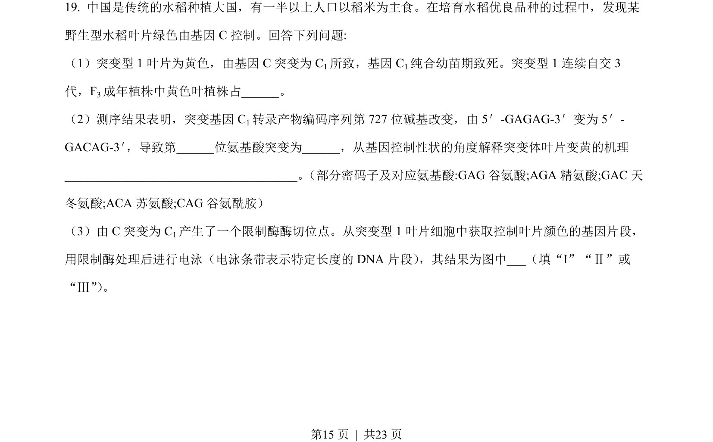
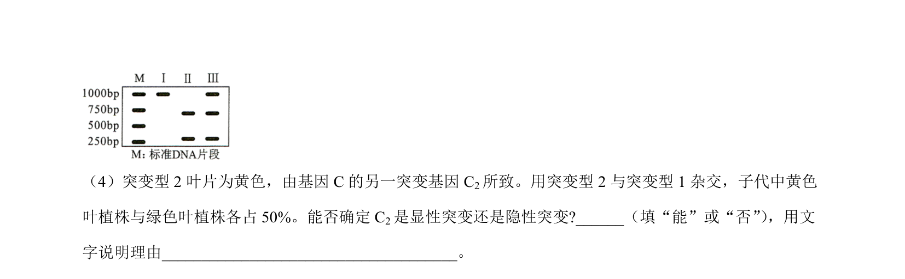
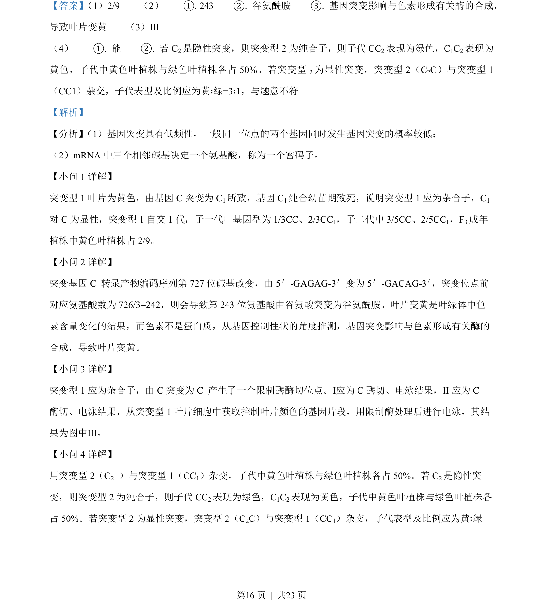

## 题面

## 摘要

本题通过遗传杂交实验、电泳分析及生态实验，考查基因突变、性状遗传、种间关系及福寿螺对水体的影响。

## 关联考点

- [[301-基因突变|基因突变]]
- [[891-显隐性关系|显隐性关系]]
- [[667-种间竞争|种间竞争]]
- [[664-种群密度调查|种群密度调查]]

## 答案与解析

> 📄 原 PDF 第 15 页：`素材/真题/湖南/2008-2024·（湖南）生物高考真题/2022年高考生物试卷（湖南）（解析卷）.pdf`
