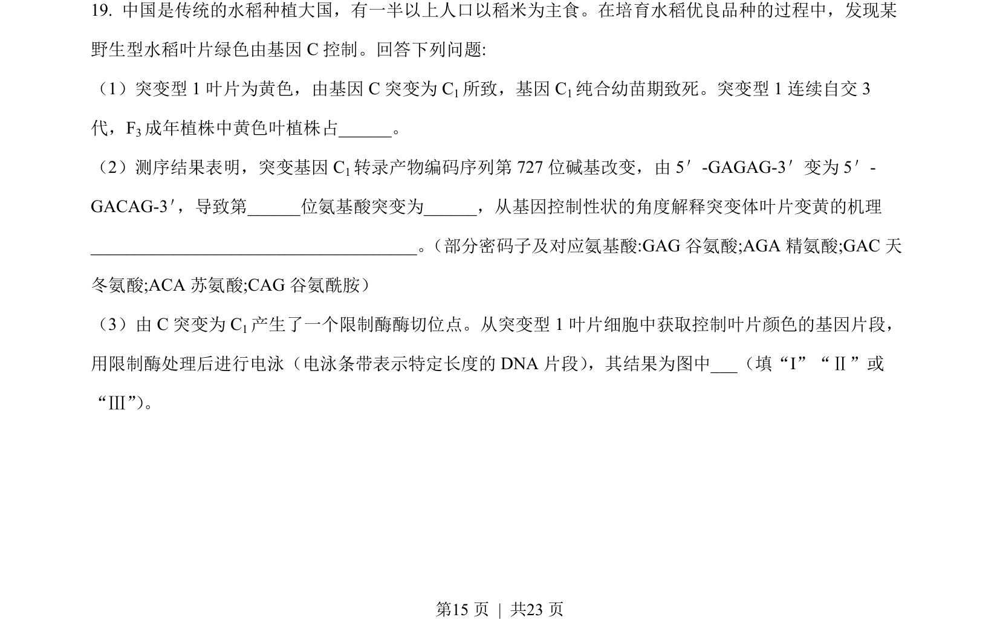
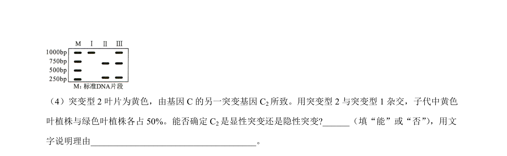
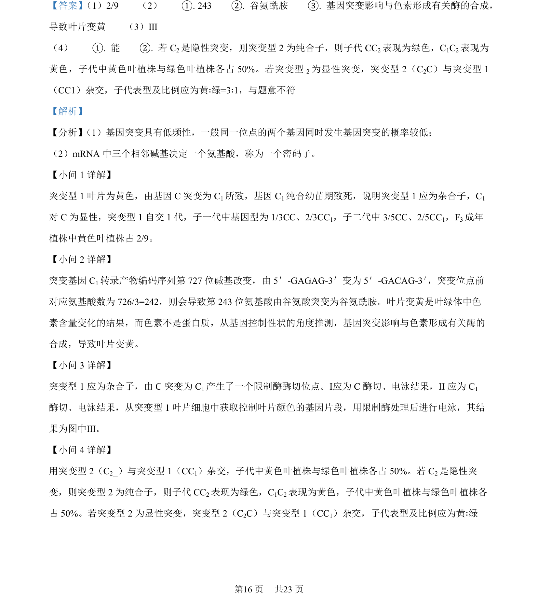

## 题面

## 摘要

本题通过遗传杂交实验、电泳分析及生态实验，考查基因突变、性状遗传、种间关系及福寿螺对水体的影响。

## 关联考点

- [[301-基因突变|基因突变]]
- [[891-显隐性关系|显隐性关系]]
- [[667-种间竞争|种间竞争]]
- [[664-种群密度调查|种群密度调查]]

## 答案与解析

> 📄 原 PDF 第 15 页：`素材/真题/湖南/2008-2024·（湖南）生物高考真题/2022年高考生物试卷（湖南）（解析卷）.pdf`

<!-- 题干文本-start -->
## 题干文本
19. 中国是传统的水稻种植大国，有一半以上人口以稻米为主食。在培育水稻优良品种的过程中，发现某
野生型水稻叶片绿色由基因 C控制。回答下列问题:
（1）突变型 1 叶片为黄色，由基因 C突变为 C1所致，基因 C1纯合幼苗期致死。突变型 1 连续自交 3
代，F3成年植株中黄色叶植株占______。
（2）测序结果表明，突变基因 C1转录产物编码序列第 727位碱基改变，由 5＇-GAGAG-3＇变为 5＇-
GACAG-3＇ ，导致第______位氨基酸突变为______，从基因控制性状的角度解释突变体叶片变黄的机理
_____________________________________。 （部分密码子及对应氨基酸:GAG 谷氨酸;AGA 精氨酸;GAC 天
冬氨酸;ACA 苏氨酸;CAG 谷氨酰胺）
（3）由 C突变为 C1产生了一个限制酶酶切位点。从突变型 1 叶片细胞中获取控制叶片颜色的基因片段，
用限制酶处理后进行电泳（电泳条带表示特定长度的 DNA 片段） ，其结果为图中___（填“I”“Ⅱ”或
“Ⅲ”） 。  
【
<!-- 题干文本-end -->

<!-- 解析文本-start -->
## 解析文本

<!-- 解析文本-end -->
