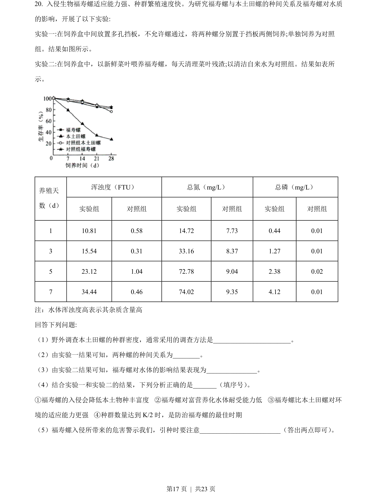
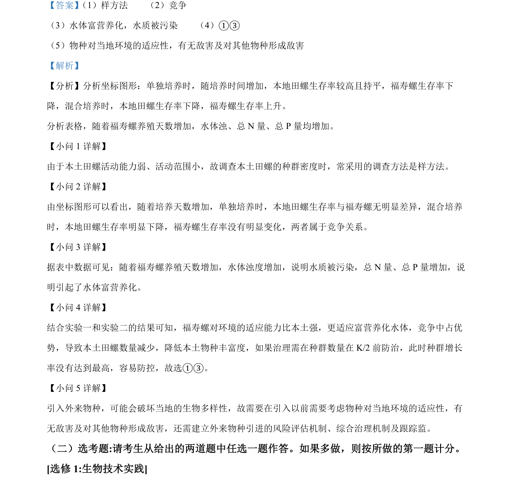

## 题面

## 摘要

考查种群密度调查方法、种间竞争关系、水体富营养化及外来物种入侵的生态影响与防治。

## 关联考点

- [[366-样方法|样方法]]
- [[765-竞争|竞争]]
- [[水体富营养化]]
- [[生物入侵防治]]

## 答案与解析

> 📄 原 PDF 第 17 页：`素材/真题/湖南/2008-2024·（湖南）生物高考真题/2022年高考生物试卷（湖南）（解析卷）.pdf`
