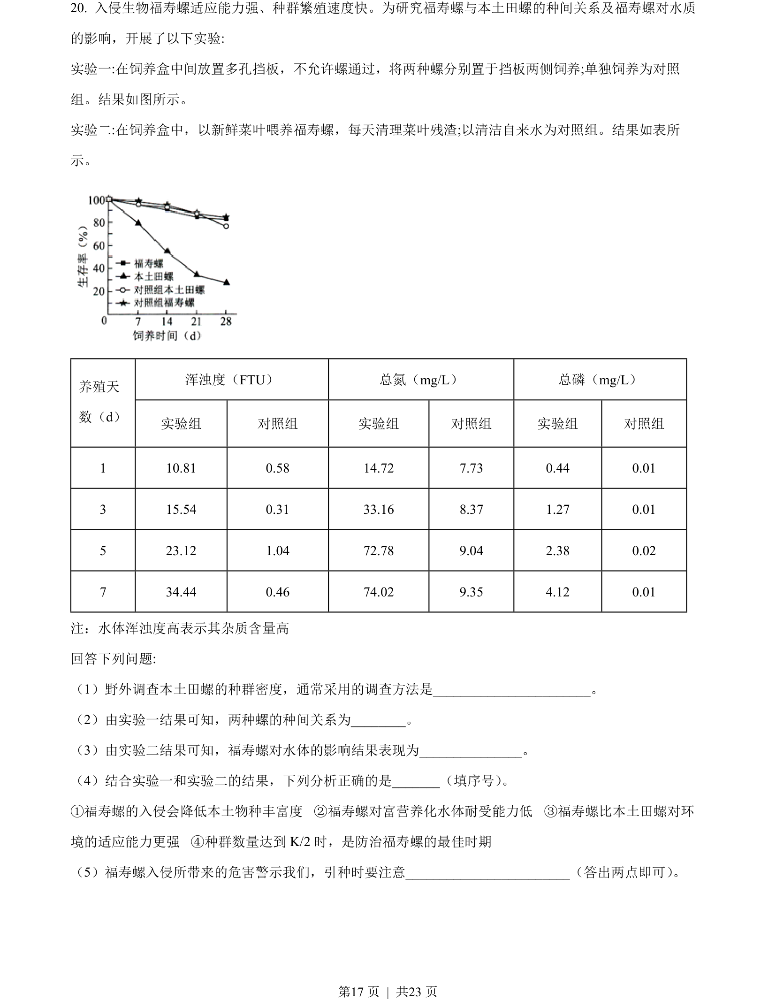
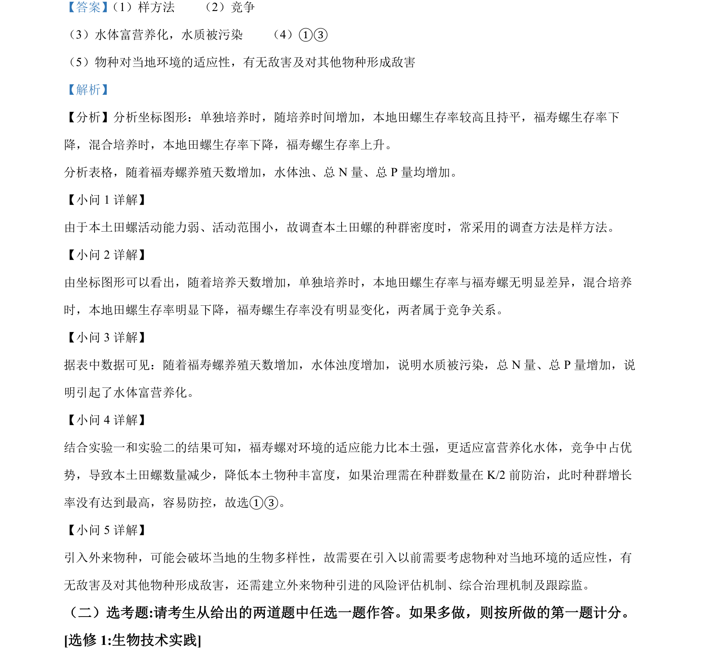

## 题面

## 摘要

考查种群密度调查方法、种间竞争关系、水体富营养化及外来物种入侵的生态影响与防治。

## 关联考点

- [[366-样方法|样方法]]
- [[765-竞争|竞争]]
- [[水体富营养化]]
- [[生物入侵防治]]

## 答案与解析

> 📄 原 PDF 第 17 页：`素材/真题/湖南/2008-2024·（湖南）生物高考真题/2022年高考生物试卷（湖南）（解析卷）.pdf`

<!-- 题干文本-start -->
## 题干文本
20. 入侵生物福寿螺适应能力强、种群繁殖速度快。为研究福寿螺与本土田螺的种间关系及福寿螺对水质
的影响，开展了以下实验:
实验一:在饲养盒中间放置多孔挡板，不允许螺通过，将两种螺分别置于挡板两侧饲养;单独饲养为对照
组。结果如图所示。
实验二:在饲养盒中，以新鲜菜叶喂养福寿螺，每天清理菜叶残渣;以清洁自来水为对照组。结果如表所
示。
浑浊度（FTU） 总氮（mg/L） 总磷（mg/L）养殖天
数（d） 实验组 对照组 实验组 对照组 实验组 对照组
1 10.81 0.58 14.72 7.73 0.44 0.01
3 15.54 0.31 33.16 8.37 1.27 0.01
5 23.12 1.04 72.78 9.04 2.38 0.02
7 34.44 0.46 74.02 9.35 4.12 0.01
注：水体浑浊度高表示其杂质含量高
回答下列问题:
（1）野外调查本土田螺的种群密度，通常采用的调查方法是_______________________。
（2）由实验一结果可知，两种螺的种间关系为________。
（3）由实验二结果可知，福寿螺对水体的影响结果表现为_______________。
（4）结合实验一和实验二的结果，下列分析正确的是_______（填序号） 。
①福寿螺的入侵会降低本土物种丰富度  ②福寿螺对富营养化水体耐受能力低  ③福寿螺比本土田螺对环
境的适应能力更强  ④种群数量达到 K/2 时，是防治福寿螺的最佳时期
（5）福寿螺入侵所带来的危害警示我们，引种时要注意________________________（答出两点即可） 。
<!-- 题干文本-end -->

<!-- 解析文本-start -->
## 解析文本

<!-- 解析文本-end -->
