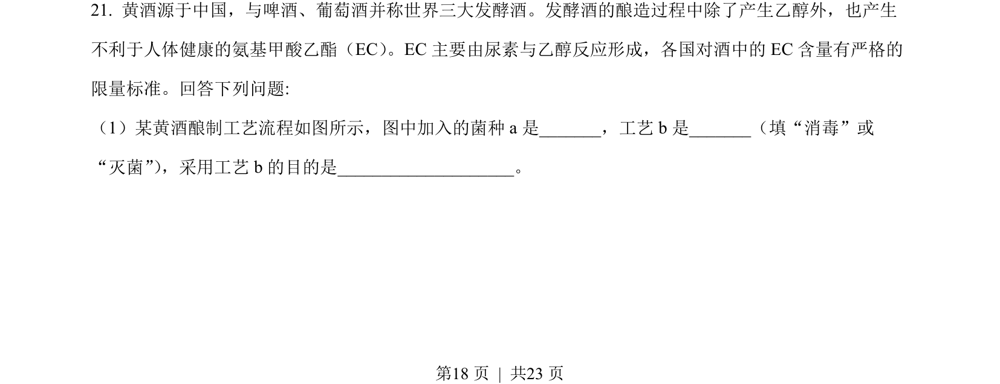
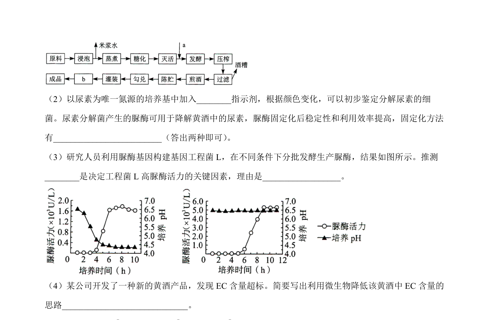
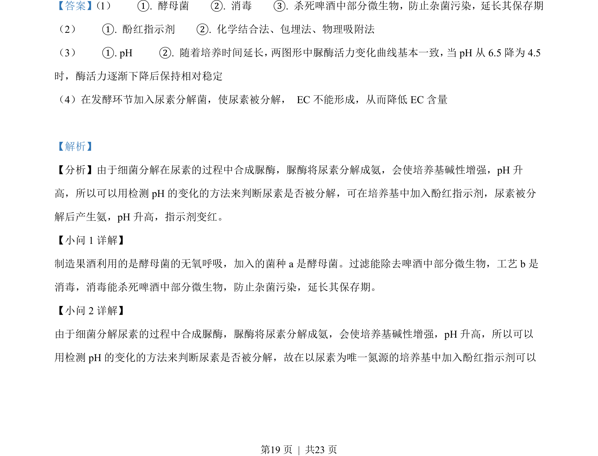
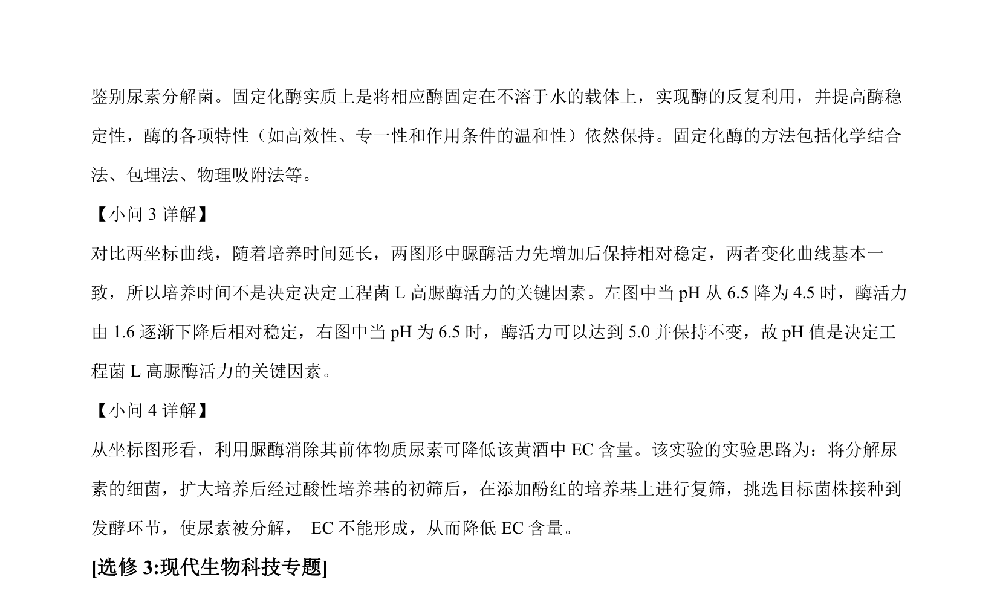

## 题面

## 摘要

该题考查微生物发酵、尿素分解菌筛选、固定化酶以及蛋白质工程改造水蛭素的知识。

## 关联考点

- [[微生物的利用]]
- [[570-固定化酶|固定化酶]]
- [[698-蛋白质工程|蛋白质工程]]
- [[410-PCR|PCR]]

## 答案与解析

> 📄 原 PDF 第 18 页：`素材/真题/湖南/2008-2024·（湖南）生物高考真题/2022年高考生物试卷（湖南）（解析卷）.pdf`
