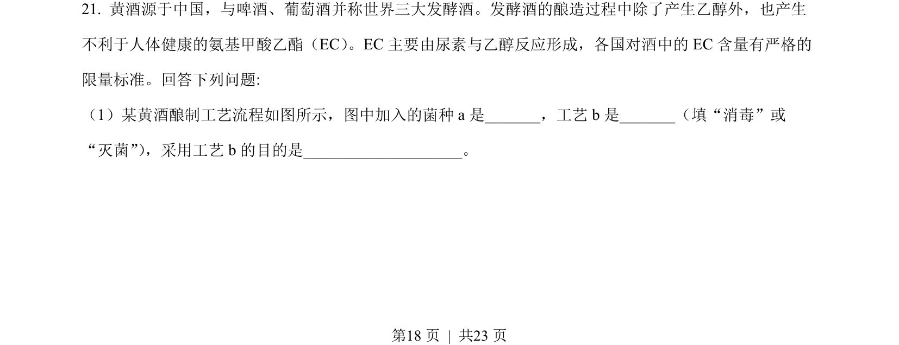
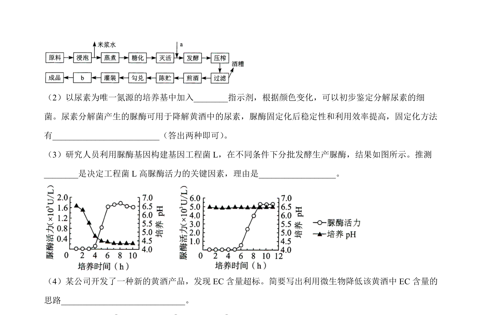
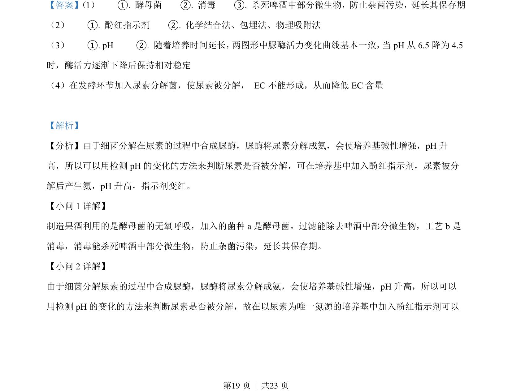
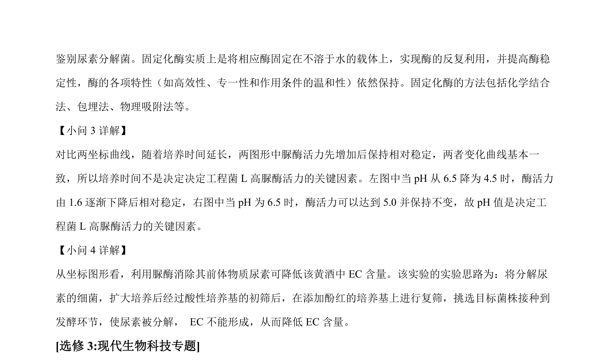

## 题面

## 摘要

该题考查微生物发酵、尿素分解菌筛选、固定化酶以及蛋白质工程改造水蛭素的知识。

## 关联考点

- [[微生物的利用]]
- [[570-固定化酶|固定化酶]]
- [[698-蛋白质工程|蛋白质工程]]
- [[410-PCR|PCR]]

## 答案与解析

> 📄 原 PDF 第 18 页：`素材/真题/湖南/2008-2024·（湖南）生物高考真题/2022年高考生物试卷（湖南）（解析卷）.pdf`

<!-- 题干文本-start -->
## 题干文本
21. 黄酒源于中国，与啤酒、葡萄酒并称世界三大发酵酒。发酵酒的酿造过程中除了产生乙醇外，也产生
不利于人体健康的氨基甲酸乙酯（EC） 。EC主要由尿素与乙醇反应形成，各国对酒中的 EC含量有严格的
限量标准。回答下列问题:
（1）某黄酒酿制工艺流程如图所示，图中加入的菌种 a是_______，工艺 b 是_______（填“消毒”或
“灭菌”） ，采用工艺b 的目的是____________________。
<!-- 题干文本-end -->

<!-- 解析文本-start -->
## 解析文本

<!-- 解析文本-end -->
