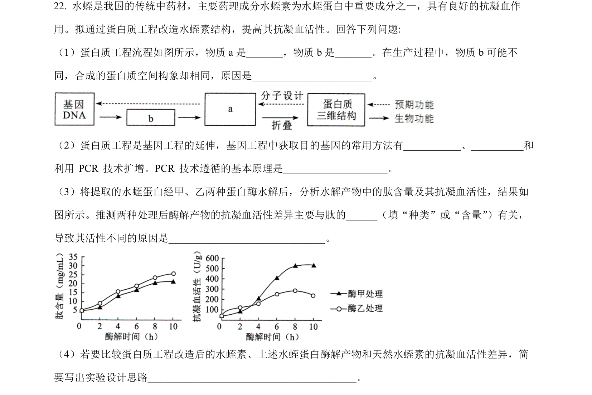
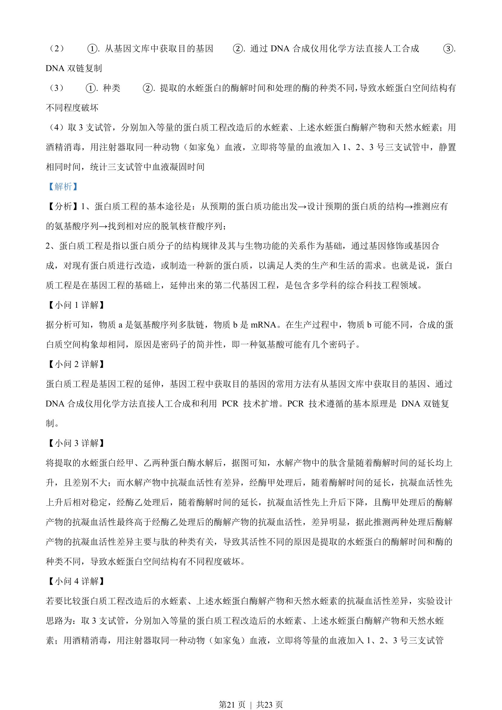

## 题面

## 摘要

本题以蛋白质工程为背景，考查基因工程获取目的基因的方法、密码子简并性及抗凝血活性实验设计。

## 关联考点

- [[698-蛋白质工程|蛋白质工程]]
- [[411-基因工程|基因工程]]
- [[密码子简并性]]
- [[482-实验设计|实验设计]]

## 答案与解析

> 📄 原 PDF 第 20 页：`素材/真题/湖南/2008-2024·（湖南）生物高考真题/2022年高考生物试卷（湖南）（解析卷）.pdf`
