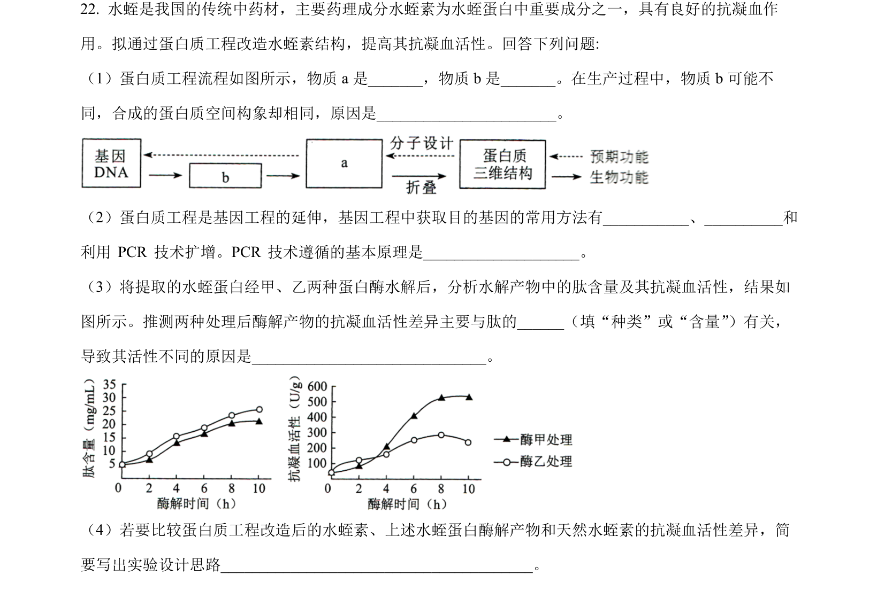
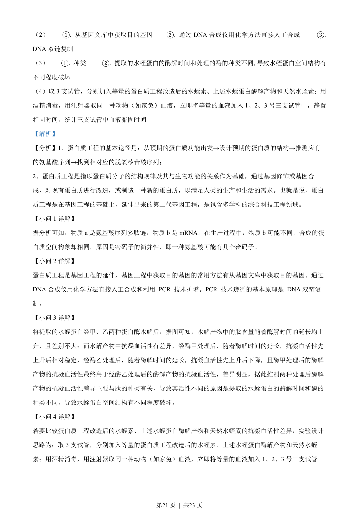

## 题面

## 摘要

本题以蛋白质工程为背景，考查基因工程获取目的基因的方法、密码子简并性及抗凝血活性实验设计。

## 关联考点

- [[698-蛋白质工程|蛋白质工程]]
- [[411-基因工程|基因工程]]
- [[密码子简并性]]
- [[482-实验设计|实验设计]]

## 答案与解析

> 📄 原 PDF 第 20 页：`素材/真题/湖南/2008-2024·（湖南）生物高考真题/2022年高考生物试卷（湖南）（解析卷）.pdf`

<!-- 题干文本-start -->
## 题干文本
22. 水蛭是我国的传统中药材，主要药理成分水蛭素为水蛭蛋白中重要成分之一，具有良好的抗凝血作
用。拟通过蛋白质工程改造水蛭素结构，提高其抗凝血活性。回答下列问题:
（1）蛋白质工程流程如图所示，物质 a是_______，物质 b 是_______。在生产过程中，物质 b 可能不
同，合成的蛋白质空间构象却相同，原因是_______________________。
（2）蛋白质工程是基因工程的延伸，基因工程中获取目的基因的常用方法有___________、__________和
利用 PCR 技术扩增。PCR 技术遵循的基本原理是____________________。
（3）将提取的水蛭蛋白经甲、乙两种蛋白酶水解后，分析水解产物中的肽含量及其抗凝血活性，结果如
图所示。推测两种处理后酶解产物的抗凝血活性差异主要与肽的______（填“种类”或“含量”）有关，
导致其活性不同的原因是______________________________。
（4）若要比较蛋白质工程改造后的水蛭素、上述水蛭蛋白酶解产物和天然水蛭素的抗凝血活性差异，简
要写出实验设计思路________________________________________。
<!-- 题干文本-end -->

<!-- 解析文本-start -->
## 解析文本
【答案】 （1）    ①. 氨基酸序列多肽链    ②.  mRNA     ③. 密码子的简并性
<!-- 解析文本-end -->
