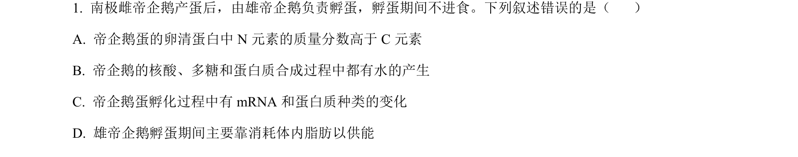
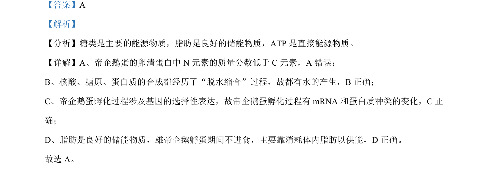

## 题面

## 摘要

考查组成细胞的分子及基因表达，判断帝企鹅蛋相关叙述的正误

## 关联考点

- [[组成细胞的分子]]
- [[脱水缩合]]
- [[基因的选择性表达]]
- [[900-能源物质|能源物质]]

## 答案与解析

> 📄 原 PDF 第 1 页：`素材/真题/湖南/2008-2024·（湖南）生物高考真题/2023年高考生物试卷（湖南）（解析卷）.pdf`
