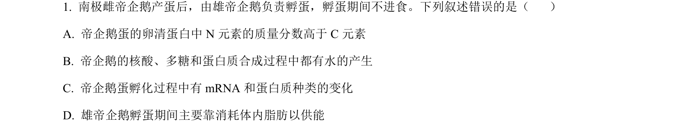
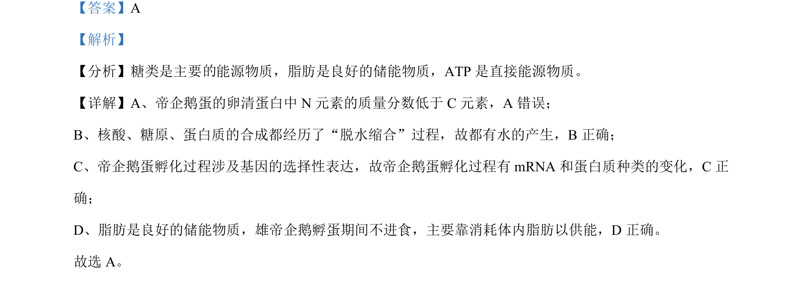

## 题面

## 摘要

考查组成细胞的分子及基因表达，判断帝企鹅蛋相关叙述的正误

## 关联考点

- [[组成细胞的分子]]
- [[脱水缩合]]
- [[基因的选择性表达]]
- [[900-能源物质|能源物质]]

## 答案与解析

> 📄 原 PDF 第 1 页：`素材/真题/湖南/2008-2024·（湖南）生物高考真题/2023年高考生物试卷（湖南）（解析卷）.pdf`

<!-- 题干文本-start -->
## 题干文本
1. 南极雌帝企鹅产蛋后，由雄帝企鹅负责孵蛋，孵蛋期间不进食。下列叙述错误的是（    ）
A. 帝企鹅蛋的卵清蛋白中 N 元素的质量分数高于 C元素
B. 帝企鹅的核酸、多糖和蛋白质合成过程中都有水的产生
C. 帝企鹅蛋孵化过程中有 mRNA 和蛋白质种类的变化
D. 雄帝企鹅孵蛋期间主要靠消耗体内脂肪以供能
<!-- 题干文本-end -->

<!-- 解析文本-start -->
## 解析文本
【答案】A
【解析】
【分析】糖类是主要 能源物质，脂肪是良好的储能物质， ATP 是直接能源物质。
【详解】A、帝企鹅蛋的卵清蛋白中 N 元素的质量分数低于 C元素，A 错误；
B、核酸、糖原、蛋白质的合成都经历了“脱水缩合”过程，故都有水的产生，B正确；
C、帝企鹅蛋孵化过程涉及基因的选择性表达，故帝企鹅蛋孵化过程有 mRNA 和蛋白质种类的变化，C正
确；
D、脂肪是良好的储能物质，雄帝企鹅孵蛋期间不进食，主要靠消耗体内脂肪以供能，D 正确。
故选 A。
<!-- 解析文本-end -->
