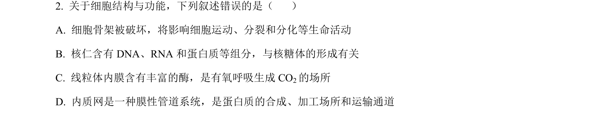
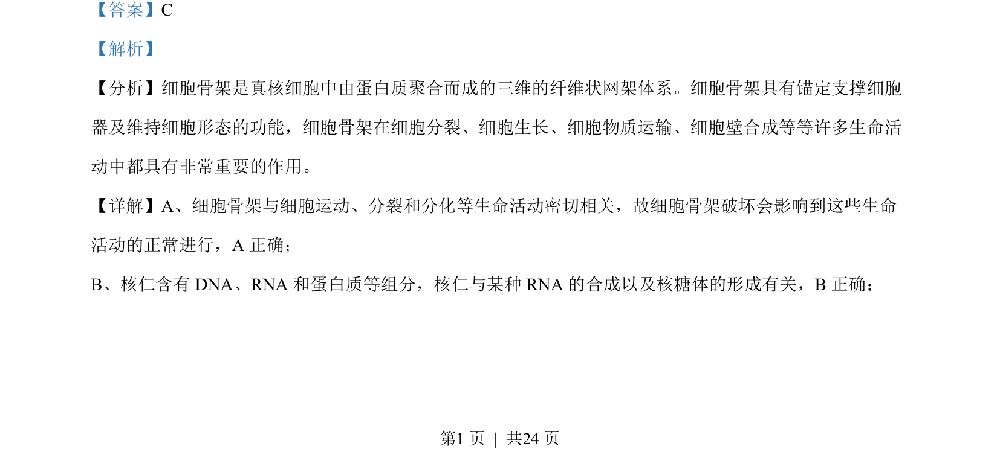
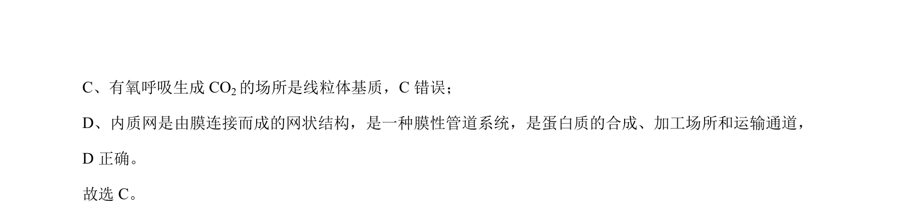

## 题面

## 摘要

本题考查细胞骨架、核仁、有氧呼吸及内质网等细胞结构与功能的基础知识。

## 关联考点

- [[细胞骨架]]
- [[895-核仁|核仁]]
- [[240-有氧呼吸|有氧呼吸]]
- [[223-内质网|内质网]]

## 答案与解析

> 📄 原 PDF 第 1 页：`素材/真题/湖南/2008-2024·（湖南）生物高考真题/2023年高考生物试卷（湖南）（解析卷）.pdf`

<!-- 题干文本-start -->
## 题干文本
2. 关于细胞结构与功能，下列叙述错误的是（    ）
A. 细胞骨架被破坏，将影响细胞运动、分裂和分化等生命活动
B. 核仁含有 DNA、RNA 和蛋白质等组分，与核糖体的形成有关
C. 线粒体内膜含有丰富的酶，是有氧呼吸生成 CO2的场所
D. 内质网是一种膜性管道系统，是蛋白质的合成、加工场所和运输通道
<!-- 题干文本-end -->

<!-- 解析文本-start -->
## 解析文本
【答案】C
【解析】
【分析】细胞骨架是真核细胞中由蛋白质聚合而成的三维的纤维状网架体系。细胞骨架具有锚定支撑细胞
器及维持细胞形态的功能，细胞骨架在细胞分裂、细胞生长、细胞物质运输、细胞壁合成等等许多生命活
动中都具有非常重要的作用。
【详解】A、细胞骨架与细胞运动、分裂和分化等生命活动密切相关，故细胞骨架破坏会影响到这些生命
活动的正常进行，A 正确；
B、核仁含有 DNA、RNA 和蛋白质等组分，核仁与某种 RNA 的合成以及核糖体的形成有关，B正确；
的
<!-- 解析文本-end -->
