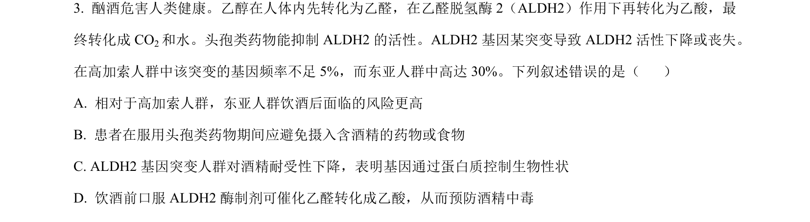
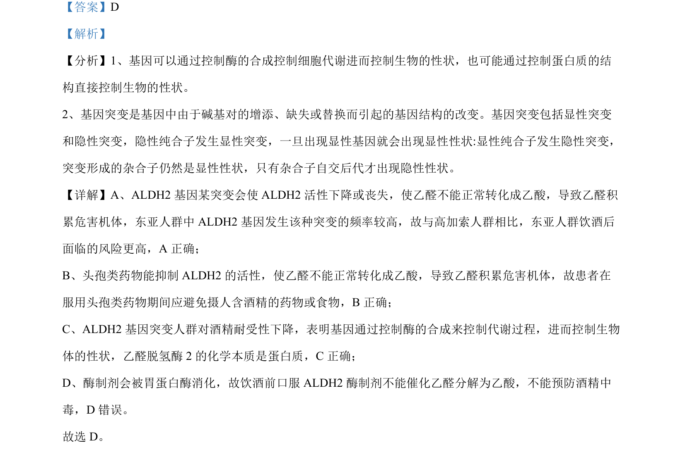

## 题面

## 摘要

本题考查ALDH2基因突变导致酶活性改变，进而影响酒精代谢及用药风险。

## 关联考点

- [[301-基因突变|基因突变]]
- [[基因对性状的控制]]
- [[518-酶活性|酶活性]]

## 答案与解析

> 📄 原 PDF 第 2 页：`素材/真题/湖南/2008-2024·（湖南）生物高考真题/2023年高考生物试卷（湖南）（解析卷）.pdf`
