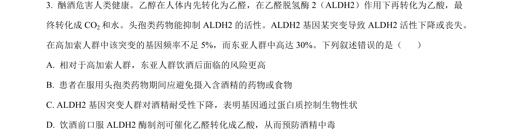
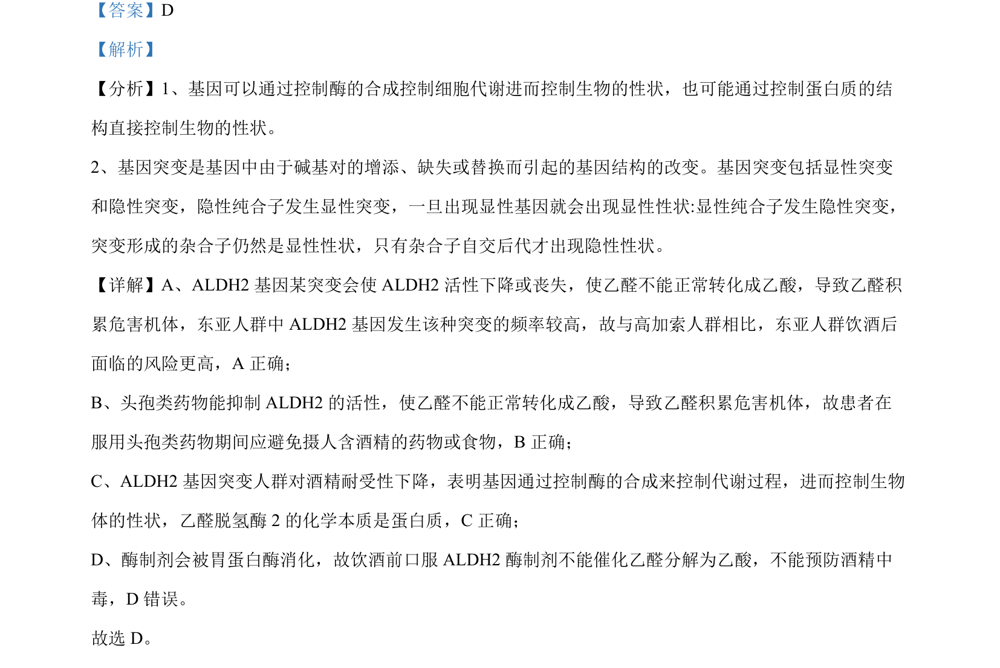

## 题面

## 摘要

本题考查ALDH2基因突变导致酶活性改变，进而影响酒精代谢及用药风险。

## 关联考点

- [[301-基因突变|基因突变]]
- [[基因对性状的控制]]
- [[518-酶活性|酶活性]]

## 答案与解析

> 📄 原 PDF 第 2 页：`素材/真题/湖南/2008-2024·（湖南）生物高考真题/2023年高考生物试卷（湖南）（解析卷）.pdf`

<!-- 题干文本-start -->
## 题干文本
3. 酗酒危害人类健康。乙醇在人体内先转化为乙醛，在乙醛脱氢酶 2（ALDH2）作用下再转化为乙酸，最
终转化成 CO2和水。头孢类药物能抑制 ALDH2 的活性。ALDH2 基因某突变导致 ALDH2 活性下降或丧失。
在高加索人群中该突变的基因频率不足 5%，而东亚人群中高达 30%。下列叙述错误的是（    ）
A. 相对于高加索人群，东亚人群饮酒后面临的风险更高
B. 患者在服用头孢类药物期间应避免摄入含酒精的药物或食物
C. ALDH2 基因突变人群对酒精耐受性下降，表明基因通过蛋白质控制生物性状
D. 饮酒前口服 ALDH2 酶制剂可催化乙醛转化成乙酸，从而预防酒精中毒
<!-- 题干文本-end -->

<!-- 解析文本-start -->
## 解析文本
【答案】D
【解析】
【分析】1、基因可以通过控制酶的合成控制细胞代谢进而控制生物的性状，也可能通过控制蛋白质的结
构直接控制生物的性状。
2、基因突变是基因中由于碱基对的增添、缺失或替换而引起的基因结构的改变。基因突变包括显性突变
和隐性突变，隐性纯合子发生显性突变，一旦出现显性基因就会出现显性性状:显性纯合子发生隐性突变，
突变形成的杂合子仍然是显性性状，只有杂合子自交后代才出现隐性性状。
【详解】A、ALDH2 基因某突变会使 ALDH2 活性下降或丧失，使乙醛不能正常转化成乙酸，导致乙醛积
累危害机体，东亚人群中 ALDH2 基因发生该种突变的频率较高，故与高加索人群相比，东亚人群饮酒后
面临的风险更高，A 正确；
B、头孢类药物能抑制 ALDH2 的活性，使乙醛不能正常转化成乙酸，导致乙醛积累危害机体，故患者在
服用头孢类药物期间应避免摄人含酒精的药物或食物，B正确；
C、ALDH2 基因突变人群对酒精耐受性下降，表明基因通过控制酶的合成来控制代谢过程，进而控制生物
体的性状，乙醛脱氢酶 2 的化学本质是蛋白质，C正确；
D、酶制剂会被胃蛋白酶消化，故饮酒前口服 ALDH2 酶制剂不能催化乙醛分解为乙酸，不能预防酒精中
毒，D 错误。
故选 D。
<!-- 解析文本-end -->
