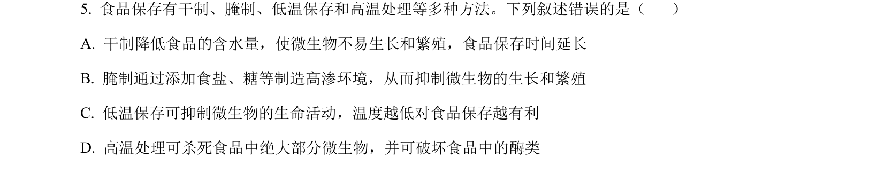
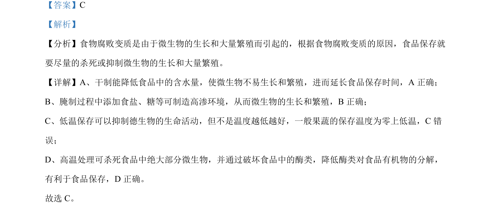

## 题面

## 摘要

考查食品保存方法的原理，分析干制、腌制、低温、高温处理对微生物生长和繁殖的影响。

## 关联考点

- [[食品保存]]
- [[微生物生长繁殖]]
- [[水分活度]]
- [[497-渗透压|渗透压]]
- [[温度控制]]

## 答案与解析

> 📄 原 PDF 第 3 页：`素材/真题/湖南/2008-2024·（湖南）生物高考真题/2023年高考生物试卷（湖南）（解析卷）.pdf`
