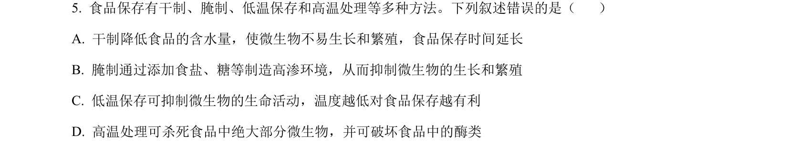
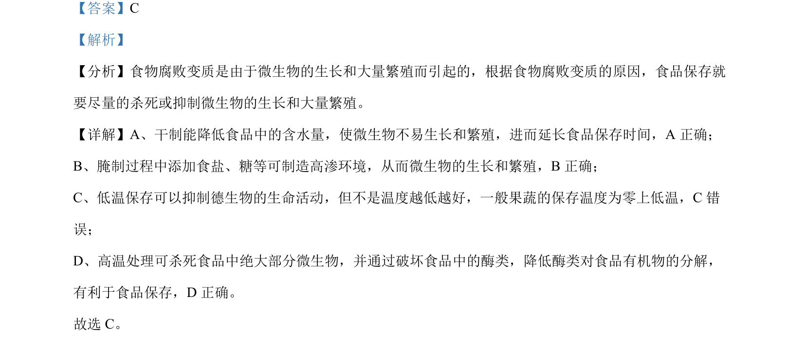

## 题面

## 摘要

考查食品保存方法的原理，分析干制、腌制、低温、高温处理对微生物生长和繁殖的影响。

## 关联考点

- [[食品保存]]
- [[微生物生长繁殖]]
- [[水分活度]]
- [[497-渗透压|渗透压]]
- [[温度控制]]

## 答案与解析

> 📄 原 PDF 第 3 页：`素材/真题/湖南/2008-2024·（湖南）生物高考真题/2023年高考生物试卷（湖南）（解析卷）.pdf`

<!-- 题干文本-start -->
## 题干文本
5. 食品保存有干制、腌制、低温保存和高温处理等多种方法。下列叙述错误的是（    ）
A. 干制降低食品的含水量，使微生物不易生长和繁殖，食品保存时间延长
B. 腌制通过添加食盐、糖等制造高渗环境，从而抑制微生物的生长和繁殖
C. 低温保存可抑制微生物的生命活动，温度越低对食品保存越有利
D. 高温处理可杀死食品中绝大部分微生物，并可破坏食品中的酶类
<!-- 题干文本-end -->

<!-- 解析文本-start -->
## 解析文本
【答案】C
【解析】
【分析】食物腐败变质是由于微生物的生长和大量繁殖而引起的，根据食物腐败变质的原因，食品保存就
要尽量的杀死或抑制微生物的生长和大量繁殖。
【详解】A、干制能降低食品中的含水量，使微生物不易生长和繁殖，进而延长食品保存时间，A 正确；
B、腌制过程中添加食盐、糖等可制造高渗环境，从而微生物的生长和繁殖，B正确；
C、低温保存可以抑制德生物的生命活动，但不是温度越低越好，一般果蔬的保存温度为零上低温，C错
误；
D、高温处理可杀死食品中绝大部分微生物，并通过破坏食品中的酶类，降低酶类对食品有机物的分解，
有利于食品保存，D 正确。
故选 C。
<!-- 解析文本-end -->
