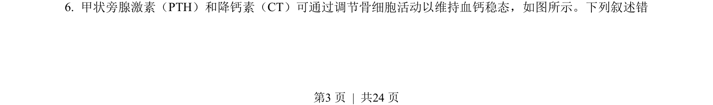
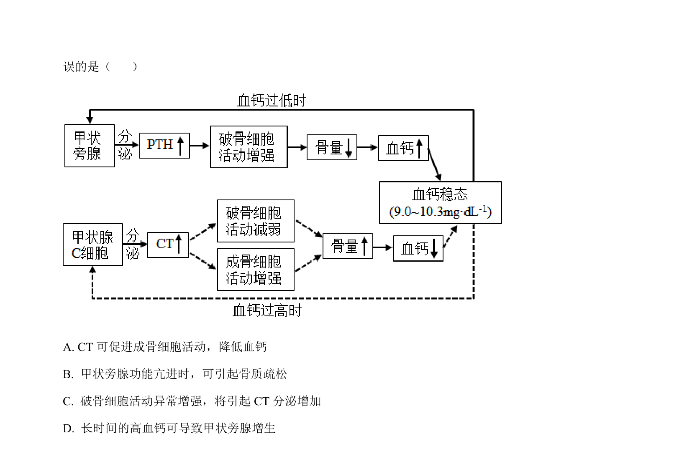
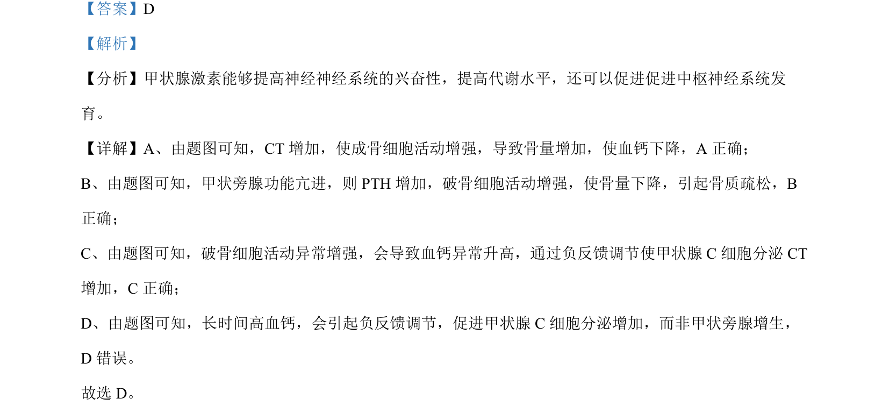

## 题面

## 摘要

考查TRPM7基因通过调控Bax和Bcl-2表达影响细胞凋亡及癌症治疗思路。

## 关联考点

- [[250-细胞凋亡|细胞凋亡]]
- [[581-基因表达调控|基因表达调控]]
- [[癌变]]
- [[RNA干扰]]

## 答案与解析

> 📄 原 PDF 第 3 页：`素材/真题/湖南/2008-2024·（湖南）生物高考真题/2023年高考生物试卷（湖南）（解析卷）.pdf`
