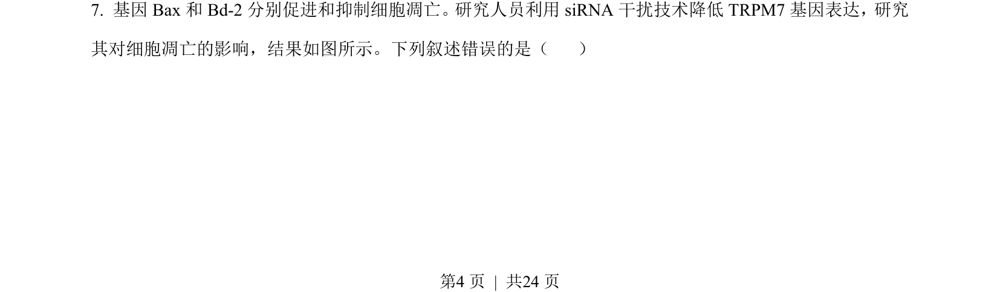
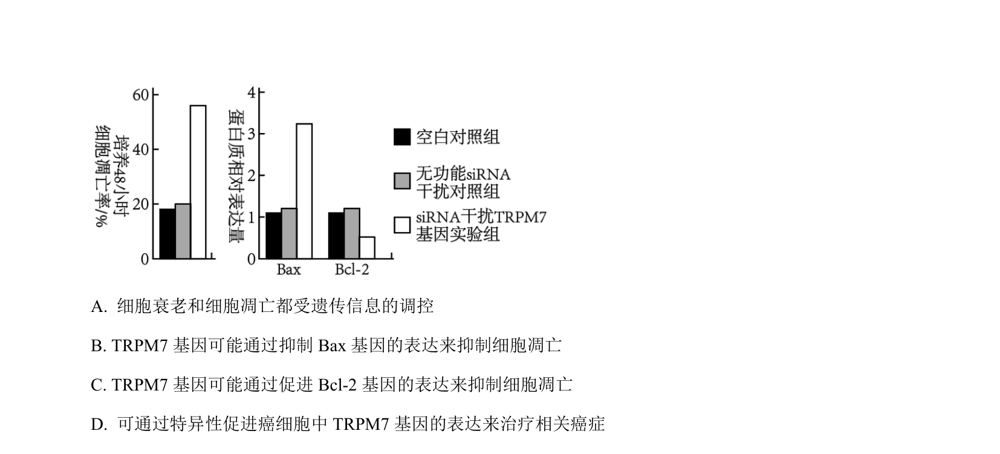
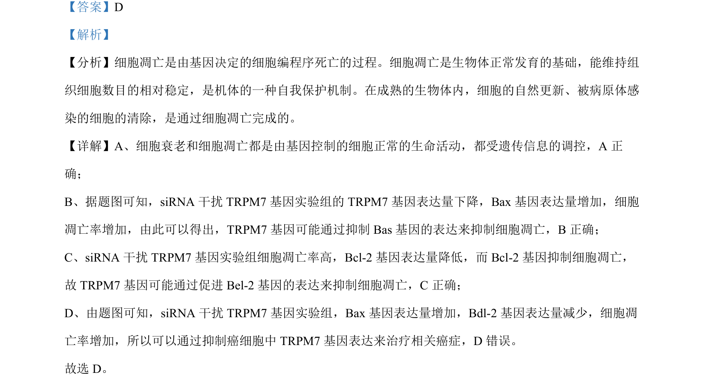

## 题面

## 摘要

盐碱胁迫下AT1蛋白调节PIP2s磷酸化影响H2O2跨膜转运的机制分析

## 关联考点

- [[927-蛋白质磷酸化|蛋白质磷酸化]]
- [[物质跨膜转运]]
- [[逆境胁迫]]
- [[581-基因表达调控|基因表达调控]]

## 答案与解析

> 📄 原 PDF 第 4 页：`素材/真题/湖南/2008-2024·（湖南）生物高考真题/2023年高考生物试卷（湖南）（解析卷）.pdf`
