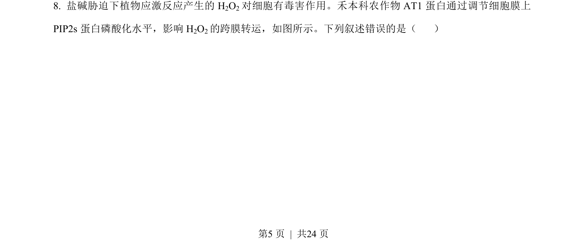
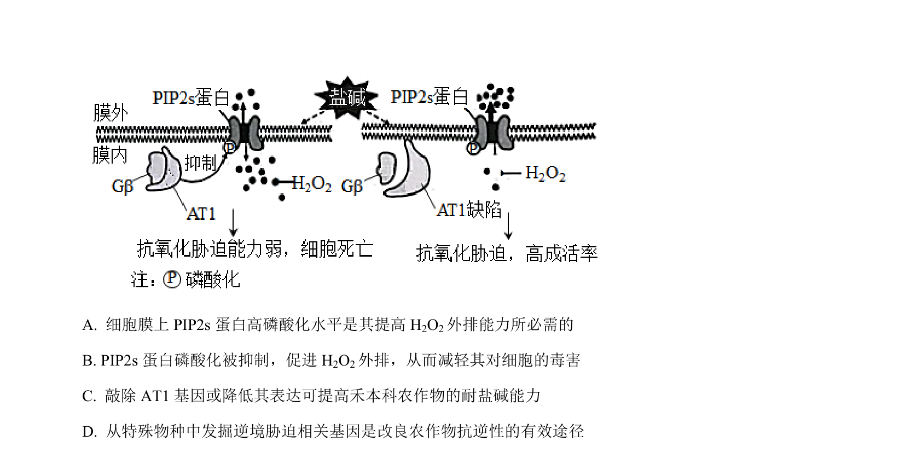
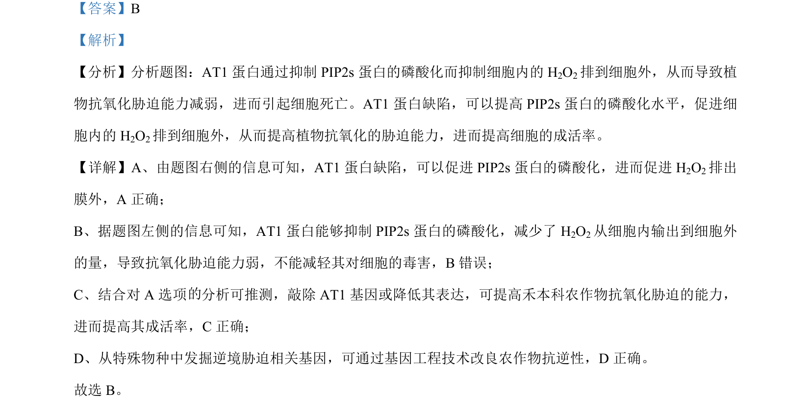

## 题面

## 摘要

考查AT1蛋白通过调控PIP2s磷酸化影响H2O2外排及抗氧化胁迫的机制。

## 关联考点

- [[927-蛋白质磷酸化|蛋白质磷酸化]]
- [[635-物质跨膜运输|物质跨膜运输]]
- [[氧化胁迫]]
- [[基因敲除]]

## 答案与解析

> 📄 原 PDF 第 5 页：`素材/真题/湖南/2008-2024·（湖南）生物高考真题/2023年高考生物试卷（湖南）（解析卷）.pdf`
