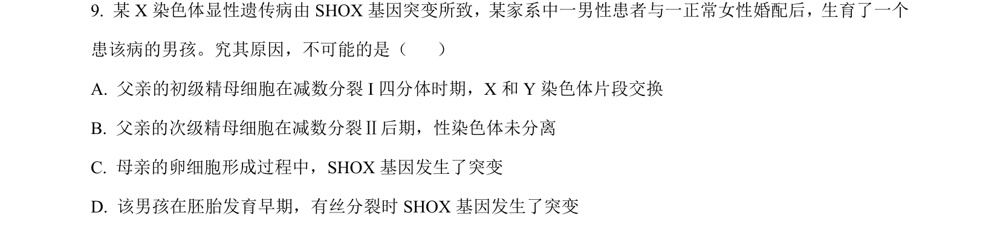
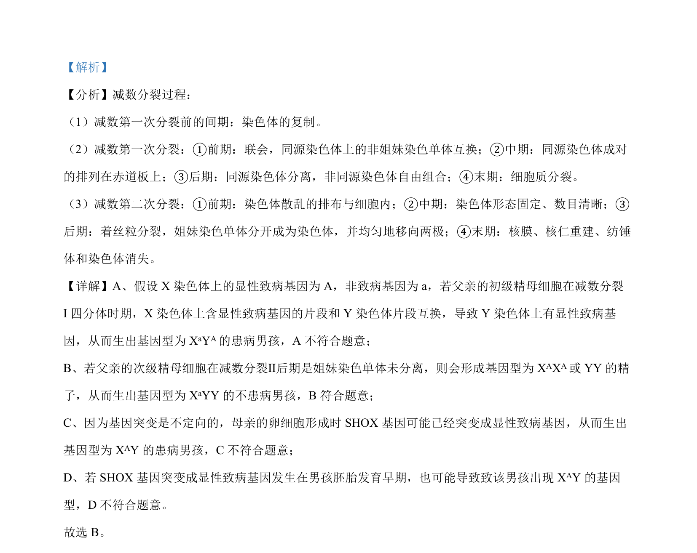

## 题面

## 摘要

该题通过分析减数分裂异常与遗传病的关系，判断产生特定基因型男孩的可能原因。

## 关联考点

- [[277-减数分裂（高中必二）|减数分裂]]
- [[914-同源染色体互换|同源染色体互换]]
- [[姐妹染色单体不分离]]
- [[301-基因突变|基因突变]]

## 答案与解析

> 📄 原 PDF 第 6 页：`素材/真题/湖南/2008-2024·（湖南）生物高考真题/2023年高考生物试卷（湖南）（解析卷）.pdf`
