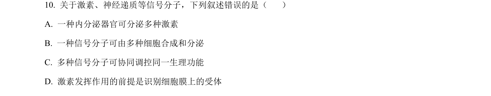
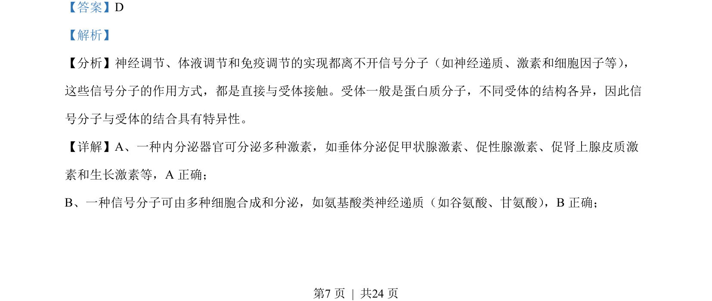
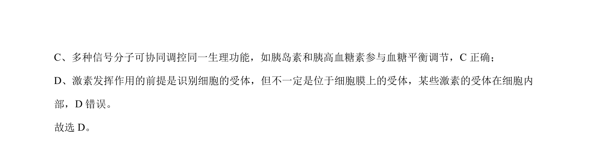

## 题面

## 摘要

本题通过信号分子与受体结合的特性，考查激素调节的特点及实例辨析。

## 关联考点

- [[信号分子]]
- [[受体特异性]]
- [[331-激素调节|激素调节]]
- [[神经体液免疫调节]]

## 答案与解析

> 📄 原 PDF 第 7 页：`素材/真题/湖南/2008-2024·（湖南）生物高考真题/2023年高考生物试卷（湖南）（解析卷）.pdf`
