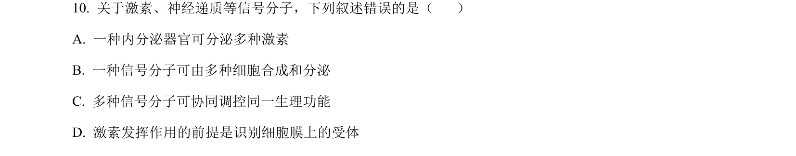
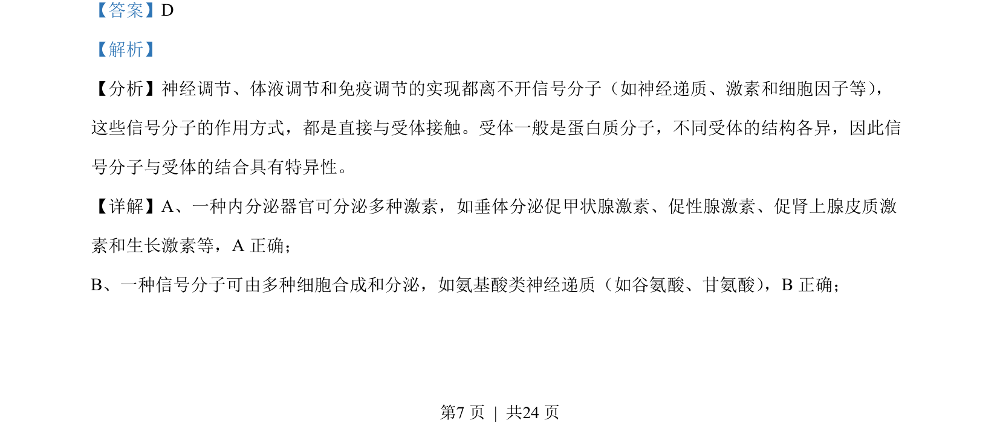
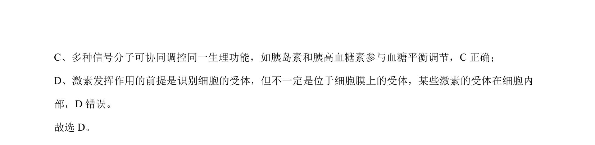

## 题面

## 摘要

本题通过信号分子与受体结合的特性，考查激素调节的特点及实例辨析。

## 关联考点

- [[信号分子]]
- [[受体特异性]]
- [[331-激素调节|激素调节]]
- [[神经体液免疫调节]]

## 答案与解析

> 📄 原 PDF 第 7 页：`素材/真题/湖南/2008-2024·（湖南）生物高考真题/2023年高考生物试卷（湖南）（解析卷）.pdf`

<!-- 题干文本-start -->
## 题干文本
10. 关于激素、神经递质等信号分子，下列叙述错误的是（    ）
A. 一种内分泌器官可分泌多种激素
B. 一种信号分子可由多种细胞合成和分泌
C. 多种信号分子可协同调控同一生理功能
D. 激素发挥作用的前提是识别细胞膜上的受体
<!-- 题干文本-end -->

<!-- 解析文本-start -->
## 解析文本
【答案】D
【解析】
【分析】神经调节、体液调节和免疫调节的实现都离不开信号分子（如神经递质、激素和细胞因子等） ，
这些信号分子的作用方式，都是直接与受体接触。受体一般是蛋白质分子，不同受体的结构各异，因此信
号分子与受体的结合具有特异性。
【详解】A、一种内分泌器官可分泌多种激素，如垂体分泌促甲状腺激素、促性腺激素、促肾上腺皮质激
素和生长激素等，A 正确；
B、一种信号分子可由多种细胞合成和分泌，如氨基酸类神经递质（如谷氨酸、甘氨酸） ，B正确；
<!-- 解析文本-end -->
