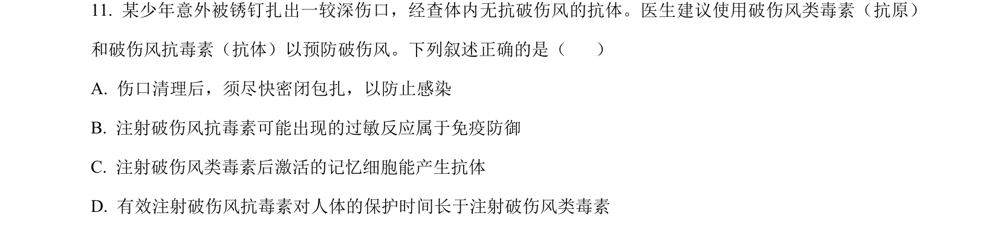
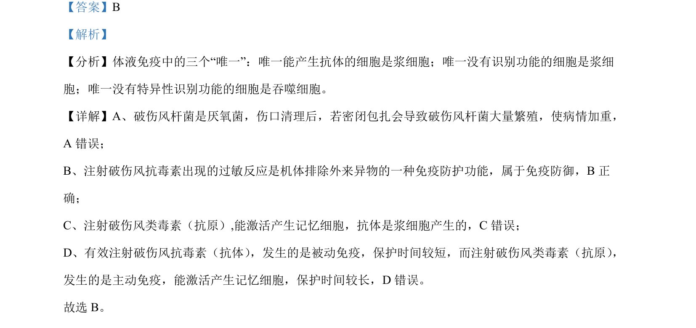

## 题面

## 摘要

细菌糖原合成中CsrAB系统调控glg基因表达及翻译过程

## 关联考点

- [[298-转录|转录]]
- [[466-interpret|翻译]]
- [[581-基因表达调控|基因表达调控]]
- [[非编码RNA]]

## 答案与解析

> 📄 原 PDF 第 8 页：`素材/真题/湖南/2008-2024·（湖南）生物高考真题/2023年高考生物试卷（湖南）（解析卷）.pdf`

<!-- 题干文本-start -->
## 题干文本
11. 某少年意外被锈钉扎出一较深伤口，经查体内无抗破伤风的抗体。医生建议使用破伤风类毒素（抗原）
和破伤风抗毒素（抗体）以预防破伤风。下列叙述正确的是（    ）
A. 伤口清理后，须尽快密闭包扎，以防止感染
B. 注射破伤风抗毒素可能出现的过敏反应属于免疫防御
C. 注射破伤风类毒素后激活的记忆细胞能产生抗体
D. 有效注射破伤风抗毒素对人体的保护时间长于注射破伤风类毒素
<!-- 题干文本-end -->

<!-- 解析文本-start -->
## 解析文本
【答案】B
【解析】
【分析】体液免疫中的三个“唯一”：唯一能产生抗体的细胞是浆细胞；唯一没有识别功能的细胞是浆细
胞；唯一没有特异性识别功能的细胞是吞噬细胞。
【详解】A、破伤风杆菌是厌氧菌，伤口清理后，若密闭包扎会导致破伤风杆菌大量繁殖，使病情加重，
A 错误；
B、注射破伤风抗毒素出现的过敏反应是机体排除外来异物的一种免疫防护功能，属于免疫防御，B正
确；
C、注射破伤风类毒素（抗原）,能激活产生记忆细胞，抗体是浆细胞产生的，C错误；
D、有效注射破伤风抗毒素（抗体） ，发生的是被动免疫，保护时间较短，而注射破伤风类毒素（抗原） ，
发生的是主动免疫，能激活产生记忆细胞，保护时间较长，D 错误。
故选 B。
<!-- 解析文本-end -->
