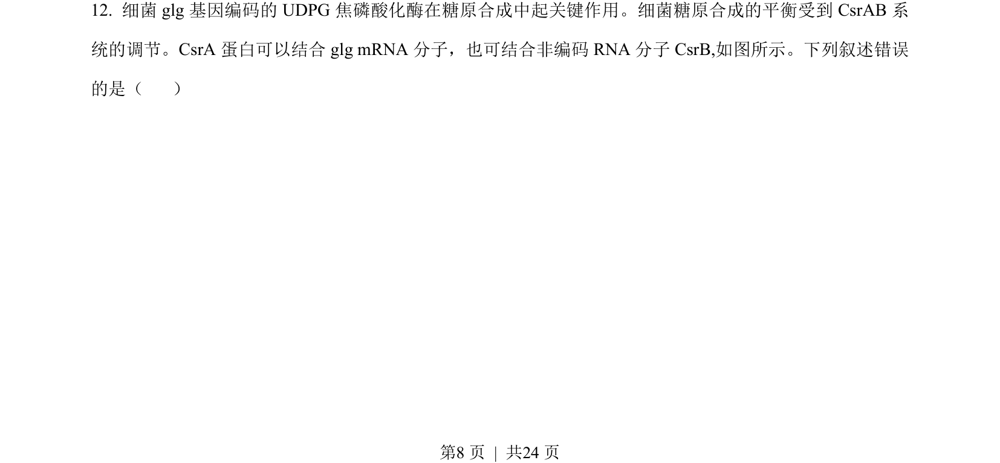
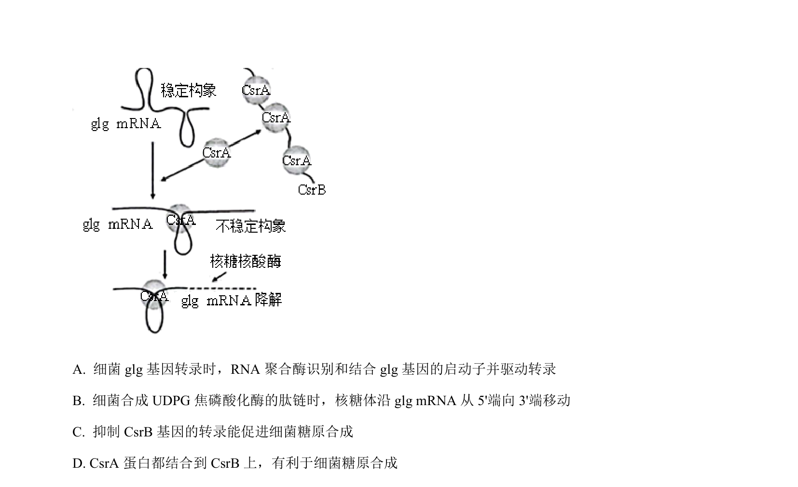
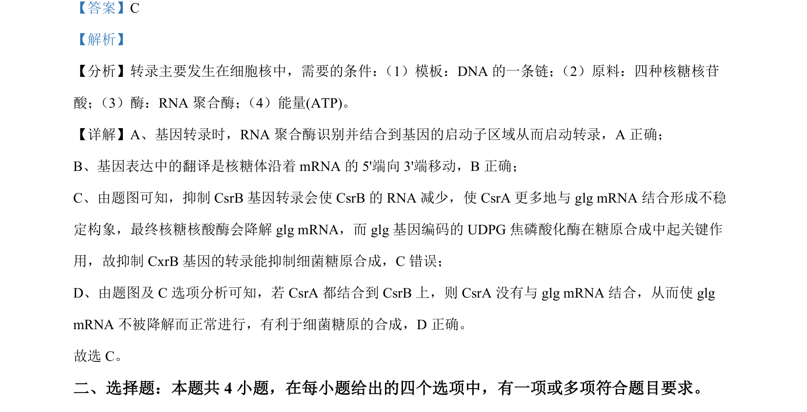

## 题面

## 摘要

本题通过基因表达调控示意图，考查转录、翻译过程及CsrA/CsrB对glg mRNA稳定性的影响。

## 关联考点

- [[基因转录]]
- [[466-interpret|翻译]]
- [[581-基因表达调控|基因表达调控]]
- [[RNA聚合酶]]

## 答案与解析

> 📄 原 PDF 第 8 页：`素材/真题/湖南/2008-2024·（湖南）生物高考真题/2023年高考生物试卷（湖南）（解析卷）.pdf`

<!-- 题干文本-start -->
## 题干文本
12. 细菌 glg 基因编码的 UDPG 焦磷酸化酶在糖原合成中起关键作用。细菌糖原合成的平衡受到 CsrAB 系
统的调节。CsrA 蛋白可以结合 glg mRNA分子，也可结合非编码 RNA 分子 CsrB,如图所示。下列叙述错误
的是（    ）
<!-- 题干文本-end -->

<!-- 解析文本-start -->
## 解析文本

<!-- 解析文本-end -->
