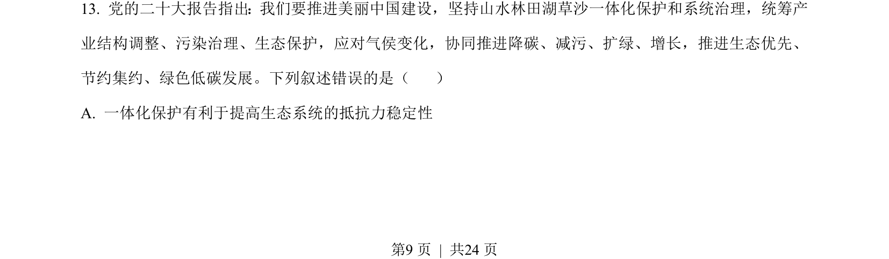
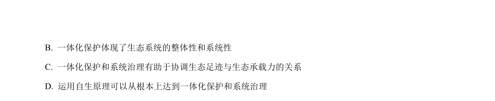
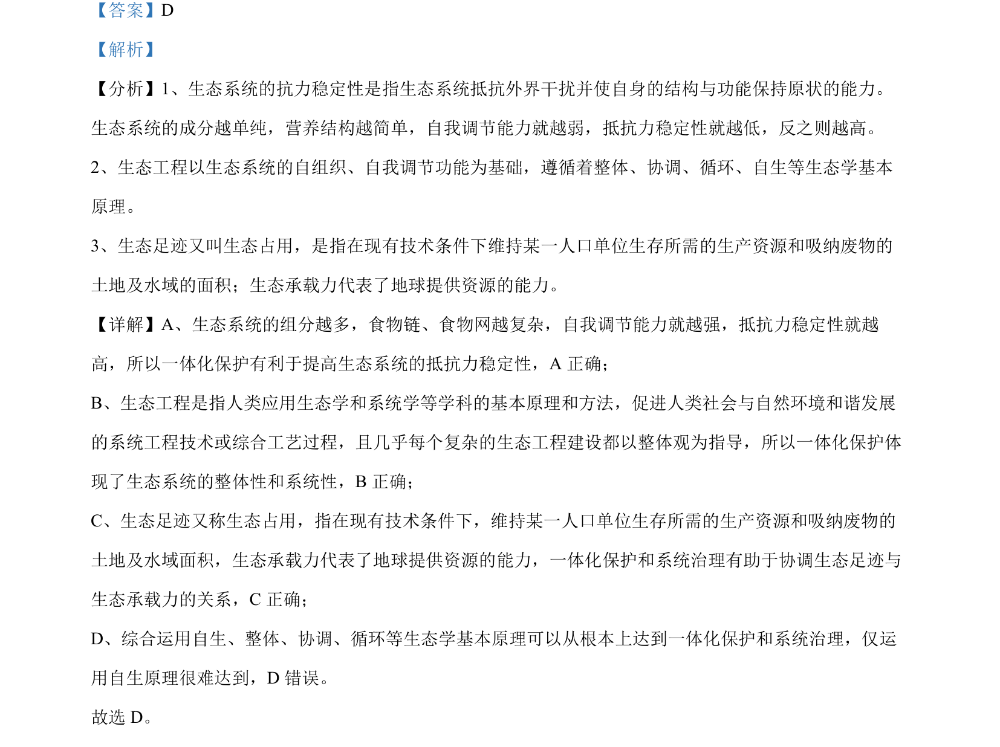

## 题面

## 摘要

考查生态系统抵抗力稳定性、生态工程整体性原理和生态足迹等概念的辨析判断。

## 关联考点

- [[生态系统抵抗力稳定性]]
- [[442-生态工程原理|生态工程原理]]
- [[400-生态足迹|生态足迹]]
- [[生态承载力]]

## 答案与解析

> 📄 原 PDF 第 9 页：`素材/真题/湖南/2008-2024·（湖南）生物高考真题/2023年高考生物试卷（湖南）（解析卷）.pdf`
