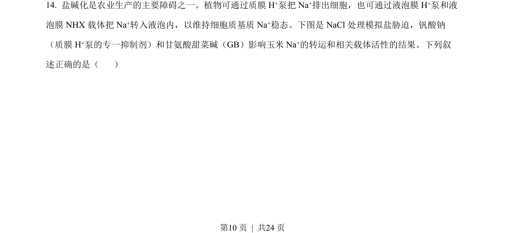
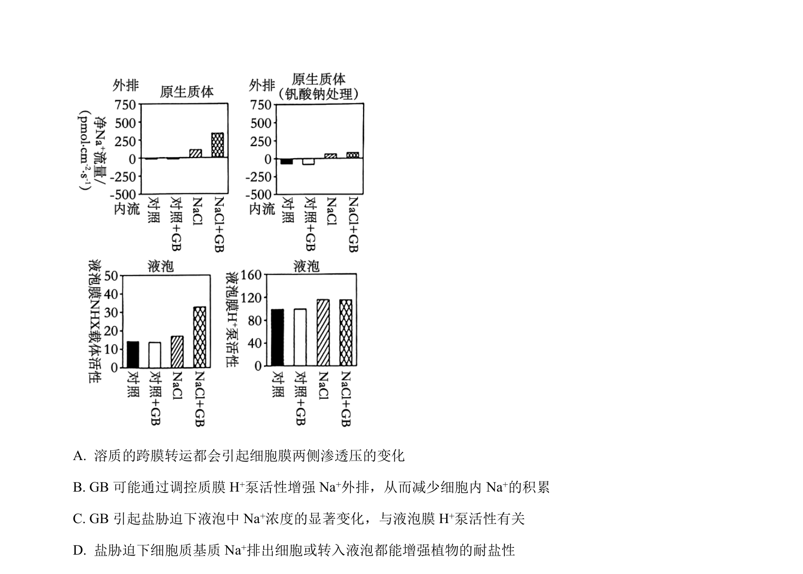
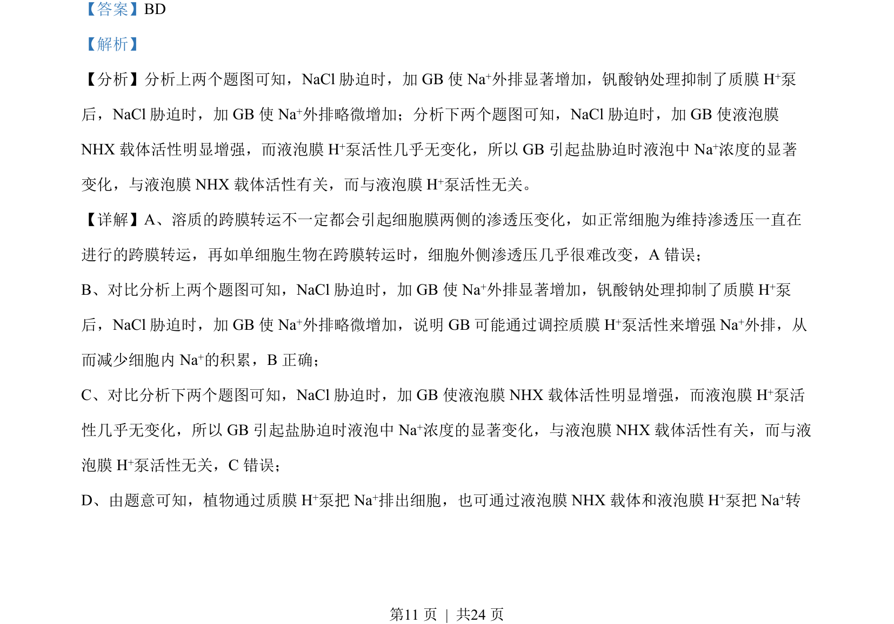
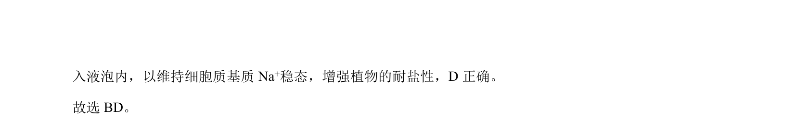

## 题面

## 摘要

水稻抗虫基因的染色体定位与同源染色体交叉互换分析

## 关联考点

- [[478-基因定位|基因定位]]
- [[539-交叉互换|交叉互换]]
- [[遗传标记]]
- [[连锁分析]]

## 答案与解析

> 📄 原 PDF 第 10 页：`素材/真题/湖南/2008-2024·（湖南）生物高考真题/2023年高考生物试卷（湖南）（解析卷）.pdf`
