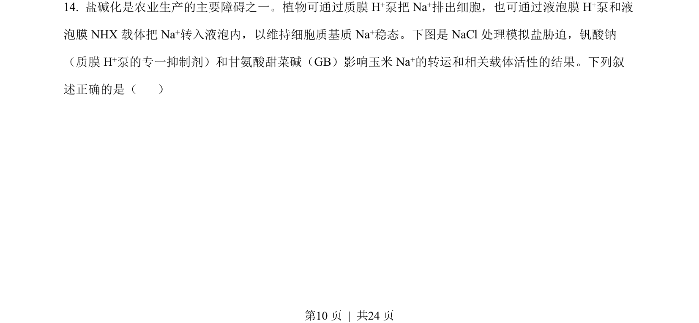
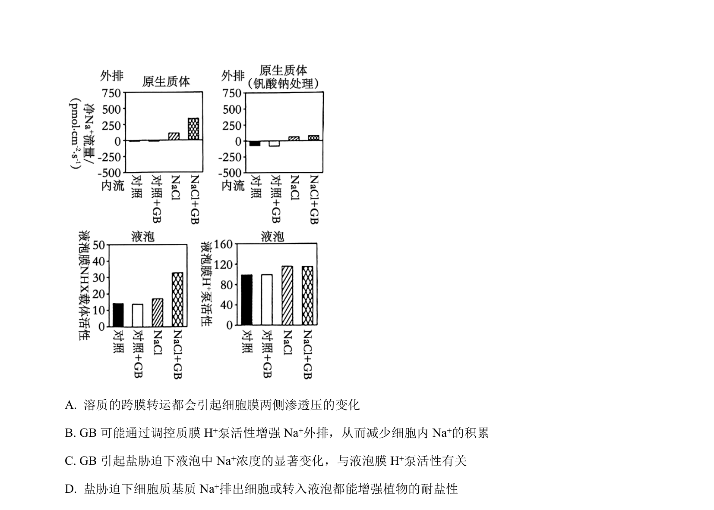
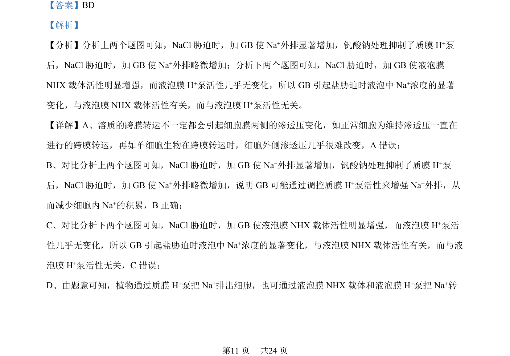

## 题面

## 摘要

水稻抗虫基因的染色体定位与同源染色体交叉互换分析

## 关联考点

- [[478-基因定位|基因定位]]
- [[539-交叉互换|交叉互换]]
- [[遗传标记]]
- [[连锁分析]]

## 答案与解析

> 📄 原 PDF 第 10 页：`素材/真题/湖南/2008-2024·（湖南）生物高考真题/2023年高考生物试卷（湖南）（解析卷）.pdf`

<!-- 题干文本-start -->
## 题干文本
14. 盐碱化是农业生产的主要障碍之一。植物可通过质膜 H+泵把 Na+排出细胞，也可通过液泡膜 H+泵和液
泡膜 NHX 载体把 Na+转入液泡内，以维持细胞质基质 Na+稳态。下图是 NaCl处理模拟盐胁迫，钒酸钠
（质膜 H+泵的专一抑制剂）和甘氨酸甜菜碱（GB）影响玉米 Na+的转运和相关载体活性的结果。下列叙
述正确的是（    ）
<!-- 题干文本-end -->

<!-- 解析文本-start -->
## 解析文本

<!-- 解析文本-end -->
