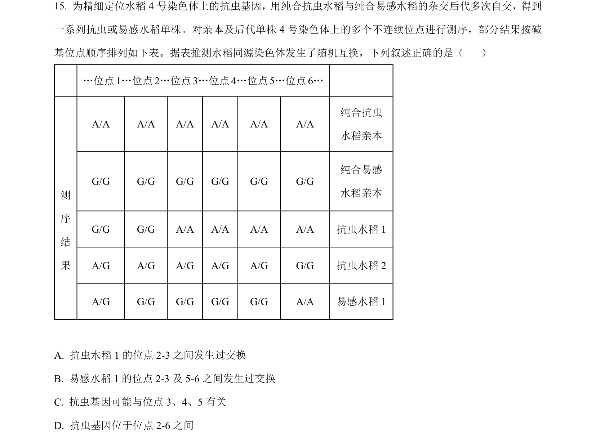
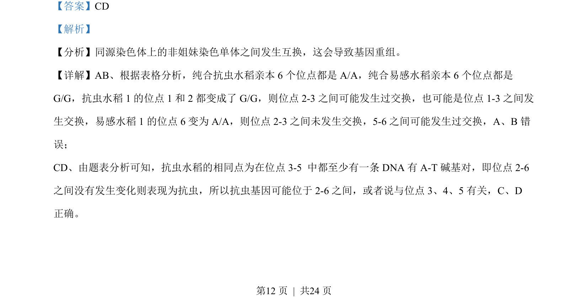

## 题面

## 摘要

通过抗虫与易感水稻亲本杂交后代基因位点分析，考查互换与基因定位。

## 关联考点

- [[302-基因重组|基因重组]]
- [[914-同源染色体互换|同源染色体互换]]
- [[478-基因定位|基因定位]]

## 答案与解析

> 📄 原 PDF 第 12 页：`素材/真题/湖南/2008-2024·（湖南）生物高考真题/2023年高考生物试卷（湖南）（解析卷）.pdf`

<!-- 题干文本-start -->
## 题干文本
15. 为精细定位水稻 4 号染色体上的抗虫基因，用纯合抗虫水稻与纯合易感水稻的杂交后代多次自交，得到
一系列抗虫或易感水稻单株。对亲本及后代单株 4 号染色体上的多个不连续位点进行测序，部分结果按碱
基位点顺序排列如下表。据表推测水稻同源染色体发生了随机互换，下列叙述正确的是（    ）
…位点 1…位点 2…位点 3…位点 4…位点 5…位点 6…
A/A A/A A/A A/A A/A A/A
纯合抗虫
水稻亲本
G/G G/G G/G G/G G/G G/G
纯合易感
水稻亲本
G/G G/G A/A A/A A/A A/A 抗虫水稻 1
A/G A/G A/G A/G A/G G/G 抗虫水稻 2
测
序
结
果
A/G G/G G/G G/G G/G A/A 易感水稻 1
A. 抗虫水稻 1 的位点 2-3 之间发生过交换
B. 易感水稻 1 的位点 2-3 及 5-6 之间发生过交换
C. 抗虫基因可能与位点 3、4、5 有关
D. 抗虫基因位于位点 2-6 之间
<!-- 题干文本-end -->

<!-- 解析文本-start -->
## 解析文本
【答案】CD
【解析】
【分析】同源染色体上的非姐妹染色单体之间发生互换，这会导致基因重组。
【详解】AB、根据表格分析，纯合抗虫水稻亲本 6 个位点都是 A/A，纯合易感水稻亲本 6 个位点都是
G/G，抗虫水稻 1 的位点 1 和 2 都变成了 G/G，则位点 2-3 之间可能发生过交换，也可能是位点 1-3 之间发
生交换，易感水稻 1 的位点 6 变为 A/A，则位点 2-3 之间未发生交换，5-6 之间可能发生过交换，A、B错
误；
CD、由题表分析可知，抗虫水稻的相同点为在位点 3-5 中都至少有一条 DNA 有 A-T 碱基对，即位点 2-6
之间没有发生变化则表现为抗虫，所以抗虫基因可能位于 2-6 之间，或者说与位点 3、4、5 有关，C、D
正确。
<!-- 解析文本-end -->
