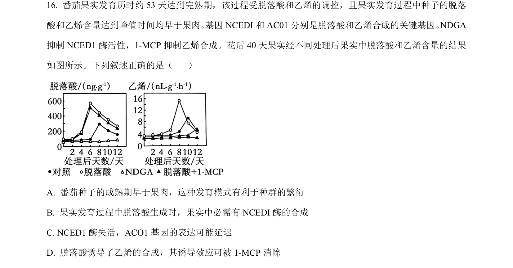
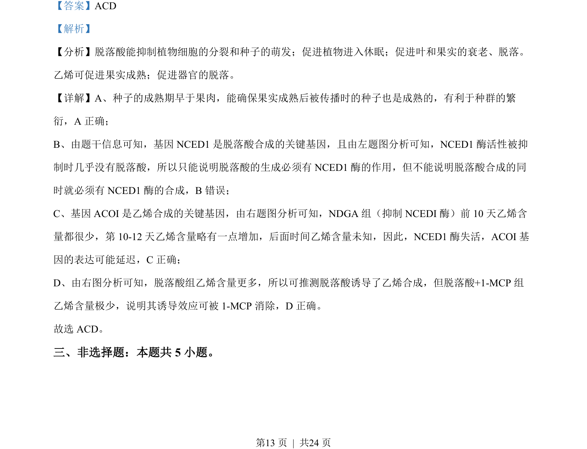

## 题面

## 摘要

考查脱落酸和乙烯的生理功能及基因表达调控实验分析

## 关联考点

- [[350-脱落酸|脱落酸]]
- [[232-乙烯|乙烯]]
- [[345-植物激素|植物激素]]
- [[479-基因表达|基因表达]]

## 答案与解析

> 📄 原 PDF 第 13 页：`素材/真题/湖南/2008-2024·（湖南）生物高考真题/2023年高考生物试卷（湖南）（解析卷）.pdf`
