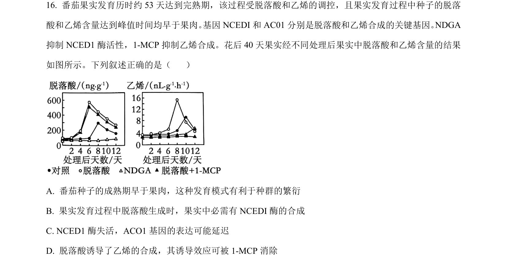
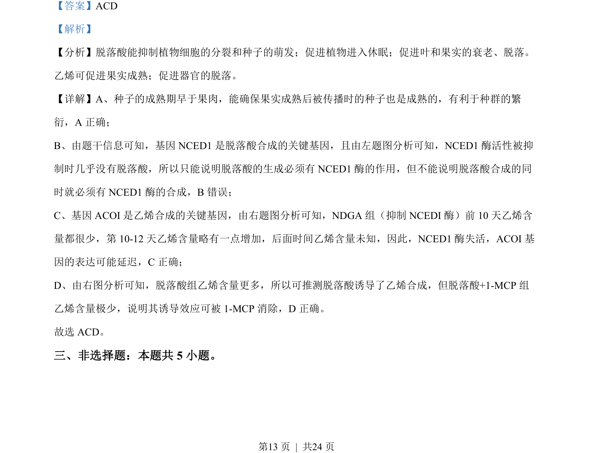

## 题面

## 摘要

考查脱落酸和乙烯的生理功能及基因表达调控实验分析

## 关联考点

- [[350-脱落酸|脱落酸]]
- [[232-乙烯|乙烯]]
- [[345-植物激素|植物激素]]
- [[843-基因的表达|基因表达]]

## 答案与解析

> 📄 原 PDF 第 13 页：`素材/真题/湖南/2008-2024·（湖南）生物高考真题/2023年高考生物试卷（湖南）（解析卷）.pdf`

<!-- 题干文本-start -->
## 题干文本
16. 番茄果实发育历时约 53 天达到完熟期，该过程受脱落酸和乙烯的调控，且果实发育过程中种子的脱落
酸和乙烯含量达到峰值时间均早于果肉。 基因NCEDI 和 AC01 分别是脱落酸和乙烯合成的关键基因。NDGA
抑制 NCED1 酶活性，1-MCP 抑制乙烯合成。花后 40 天果实经不同处理后果实中脱落酸和乙烯含量的结果
如图所示。下列叙述正确的是（    ）
  
A. 番茄种子的成熟期早于果肉，这种发育模式有利于种群的繁衍
B. 果实发育过程中脱落酸生成时，果实中必需有 NCEDI 酶的合成
C. NCED1 酶失活，ACO1 基因的表达可能延迟
D. 脱落酸诱导了乙烯的合成，其诱导效应可被 1-MCP 消除
<!-- 题干文本-end -->

<!-- 解析文本-start -->
## 解析文本
【答案】ACD
【解析】
【分析】脱落酸能抑制植物细胞的分裂和种子的萌发；促进植物进入休眠；促进叶和果实的衰老、脱落。
乙烯可促进果实成熟；促进器官的脱落。
【详解】A、种子的成熟期早于果肉，能确保果实成熟后被传播时的种子也是成熟的，有利于种群的繁
衍，A 正确；
B、由题干信息可知，基因 NCED1 是脱落酸合成的关键基因，且由左题图分析可知，NCED1 酶活性被抑
制时几乎没有脱落酸，所以只能说明脱落酸的生成必须有 NCED1 酶的作用，但不能说明脱落酸合成的同
时就必须有 NCED1 酶的合成，B错误；
C、基因 ACOI 是乙烯合成的关键基因，由右题图分析可知，NDGA 组（抑制 NCEDI 酶）前 10 天乙烯含
量都很少，第 10-12 天乙烯含量略有一点增加，后面时间乙烯含量未知，因此，NCED1 酶失活，ACOI 基
因的表达可能延迟，C正确；
D、由右图分析可知，脱落酸组乙烯含量更多，所以可推测脱落酸诱导了乙烯合成，但脱落酸+1-MCP 组
乙烯含量极少，说明其诱导效应可被 1-MCP 消除，D 正确。
故选 ACD。
三、非选择题：本题共 5小题。
<!-- 解析文本-end -->
