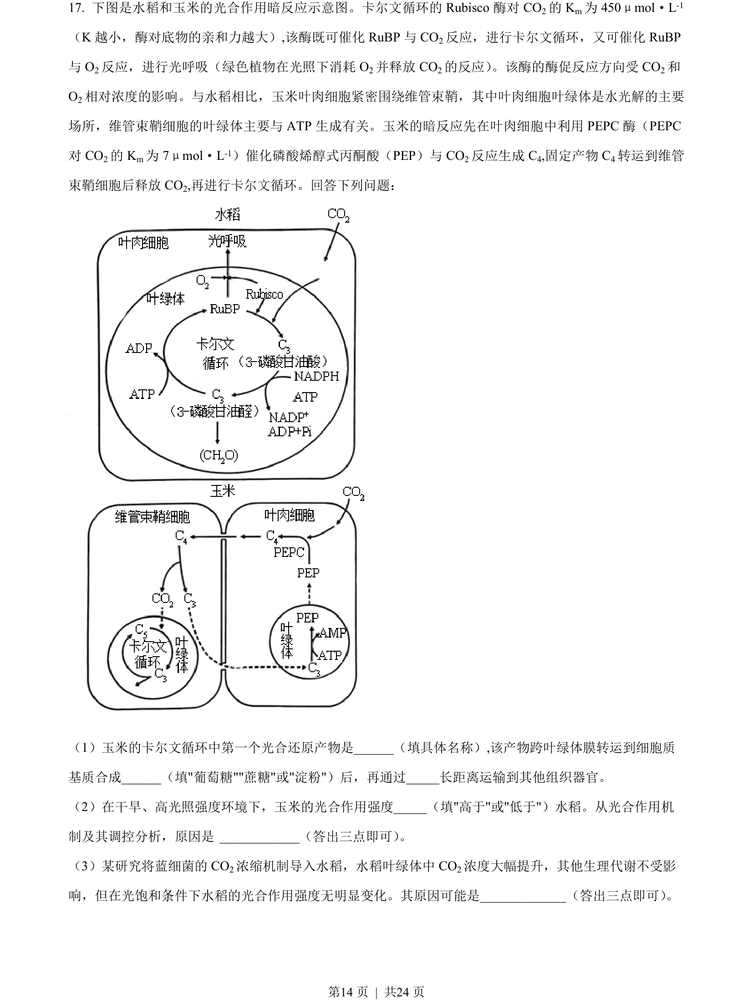
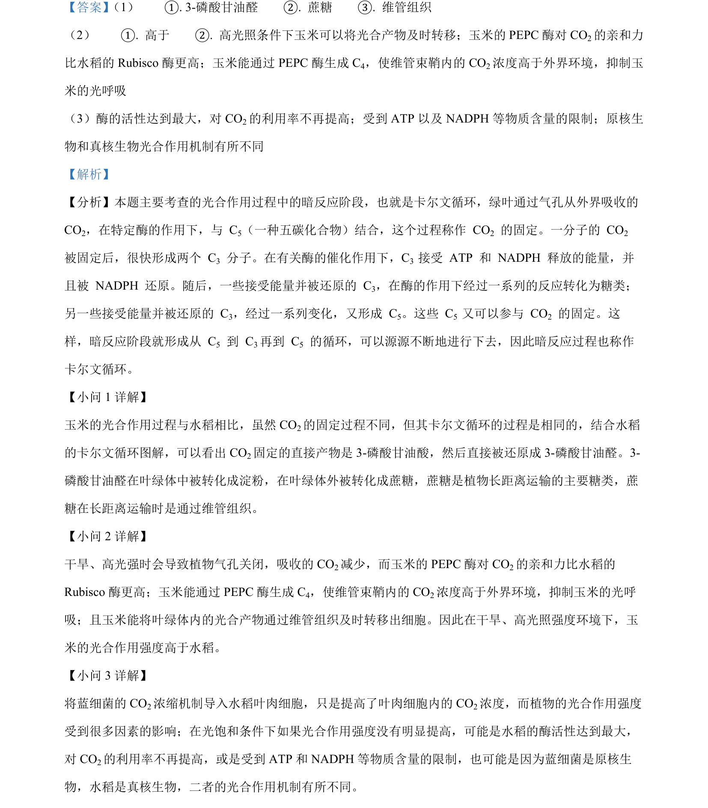

## 题面

## 摘要

本题考查光合作用暗反应过程、C3与C4植物比较及长时程增强（LTP）的机制与实验分析。

## 关联考点

- [[光合作用暗反应]]
- [[C4植物]]
- [[长时程增强]]
- [[334-反馈调节|反馈调节]]

## 答案与解析

> 📄 原 PDF 第 14 页：`素材/真题/湖南/2008-2024·（湖南）生物高考真题/2023年高考生物试卷（湖南）（解析卷）.pdf`
