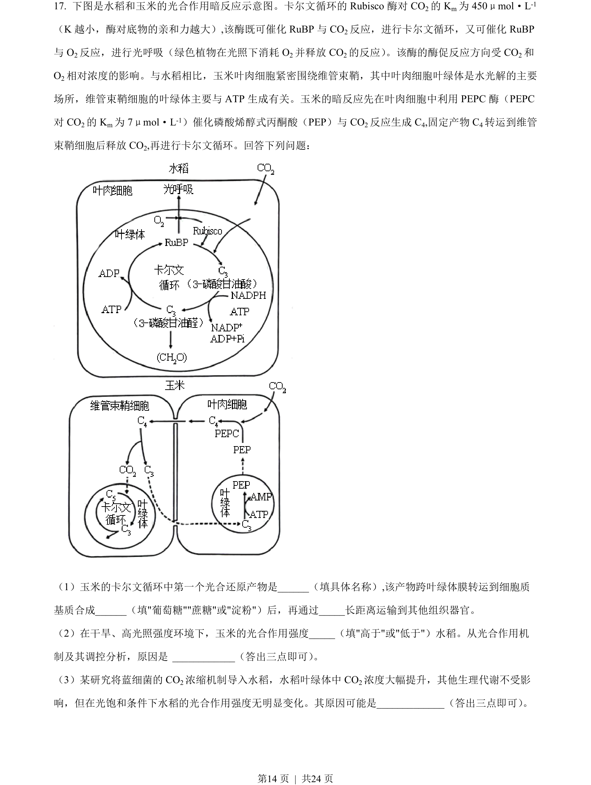
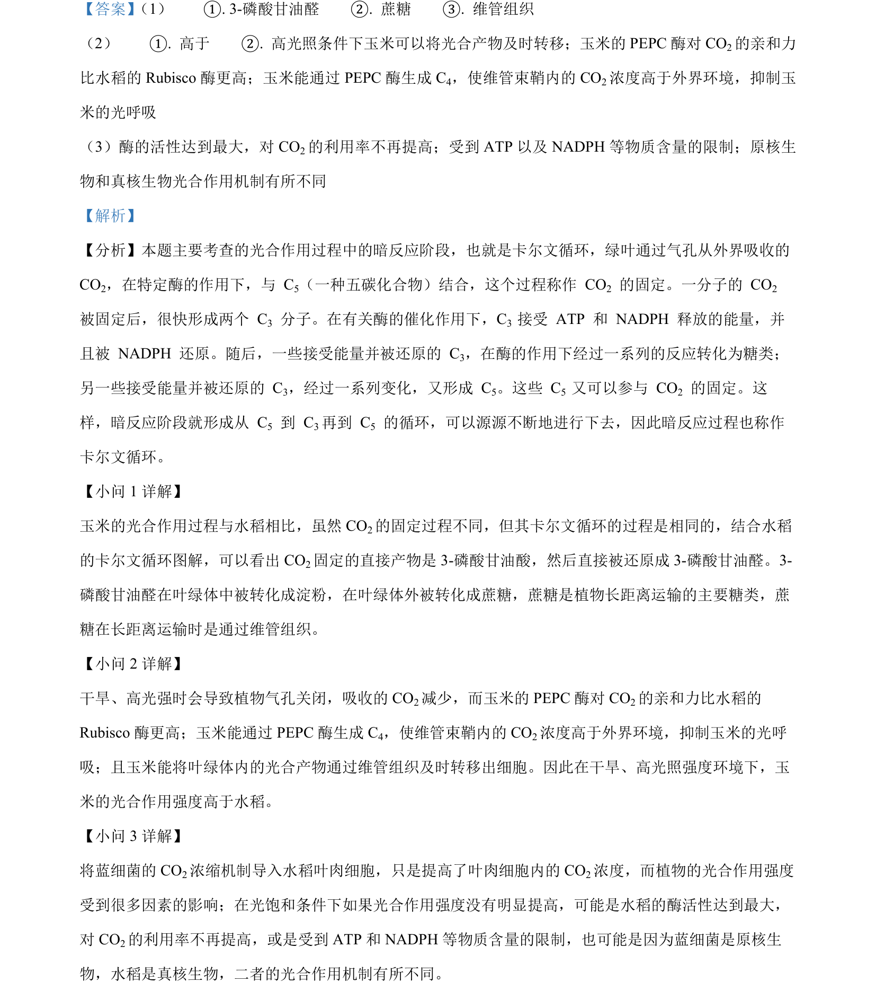

## 题面

## 摘要

本题考查光合作用暗反应过程、C3与C4植物比较及长时程增强（LTP）的机制与实验分析。

## 关联考点

- [[光合作用暗反应]]
- [[C4植物]]
- [[长时程增强]]
- [[334-反馈调节|反馈调节]]

## 答案与解析

> 📄 原 PDF 第 14 页：`素材/真题/湖南/2008-2024·（湖南）生物高考真题/2023年高考生物试卷（湖南）（解析卷）.pdf`

<!-- 题干文本-start -->
## 题干文本
17. 下图是水稻和玉米的光合作用暗反应示意图。卡尔文循环的 Rubisco 酶对 CO2的 Km为 450μmol·L-1
（K 越小，酶对底物的亲和力越大）,该酶既可催化 RuBP 与 CO2反应，进行卡尔文循环，又可催化 RuBP
与 O2反应，进行光呼吸（绿色植物在光照下消耗 O2并释放 CO2的反应） 。该酶的酶促反应方向受CO2和
O2相对浓度的影响。与水稻相比，玉米叶肉细胞紧密围绕维管束鞘，其中叶肉细胞叶绿体是水光解的主要
场所，维管束鞘细胞的叶绿体主要与 ATP 生成有关。玉米的暗反应先在叶肉细胞中利用 PEPC 酶（PEPC
对 CO2的 Km为 7μmol·L-1）催化磷酸烯醇式丙酮酸（PEP）与 CO2反应生成 C4,固定产物 C4转运到维管
束鞘细胞后释放 CO2,再进行卡尔文循环。回答下列问题：
（1）玉米的卡尔文循环中第一个光合还原产物是______（填具体名称）,该产物跨叶绿体膜转运到细胞质
基质合成______（填"葡萄糖""蔗糖"或"淀粉"）后，再通过_____长距离运输到其他组织器官。
（2）在干旱、高光照强度环境下，玉米的光合作用强度_____（填"高于"或"低于"）水稻。从光合作用机
制及其调控分析，原因是 ____________（答出三点即可） 。
（3）某研究将蓝细菌的 CO2浓缩机制导入水稻，水稻叶绿体中 CO2浓度大幅提升，其他生理代谢不受影
响，但在光饱和条件下水稻的光合作用强度无明显变化。其原因可能是_____________（答出三点即可） 。
<!-- 题干文本-end -->

<!-- 解析文本-start -->
## 解析文本

<!-- 解析文本-end -->
