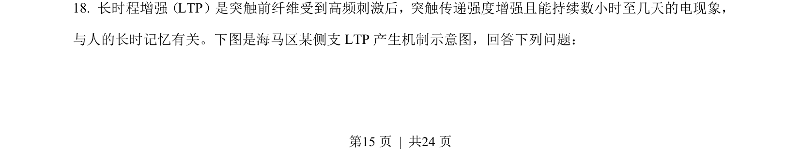
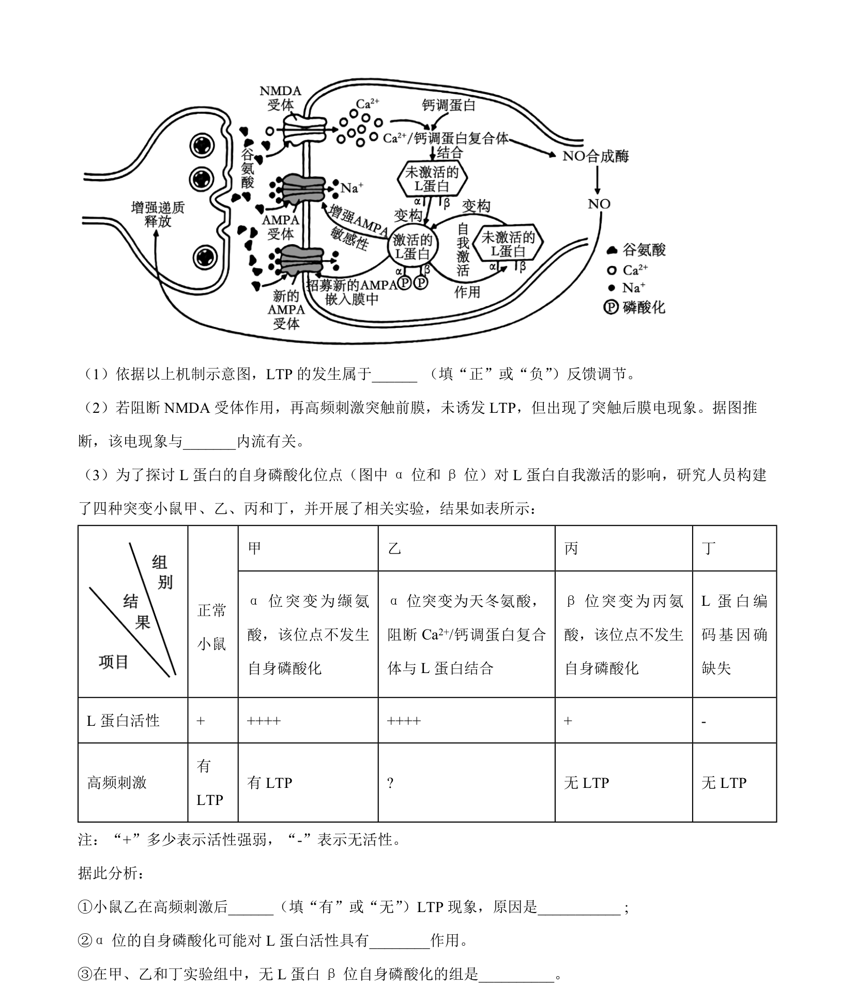
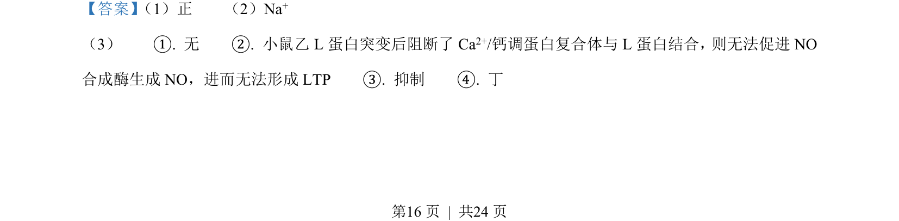
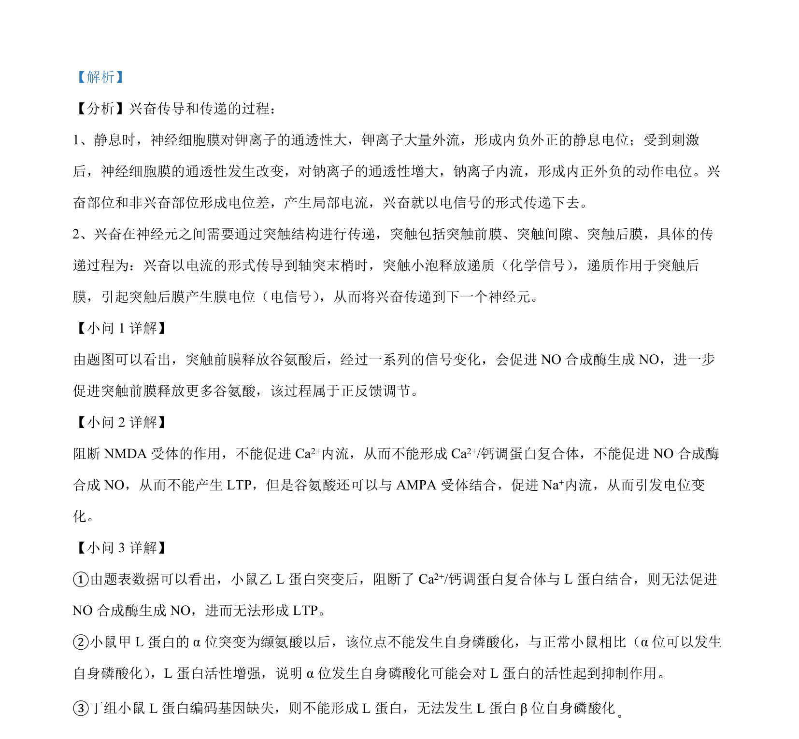

## 题面

## 摘要

考查遗传病家系遗传方式推断、概率计算、引物设计及酶切分析，并结合叶酸补充建议。

## 关联考点

- [[675-系谱分析|遗传系谱分析]]
- [[基因突变检测]]
- [[886-PCR引物设计|PCR引物设计]]
- [[限制酶酶切]]

## 答案与解析

> 📄 原 PDF 第 15 页：`素材/真题/湖南/2008-2024·（湖南）生物高考真题/2023年高考生物试卷（湖南）（解析卷）.pdf`
