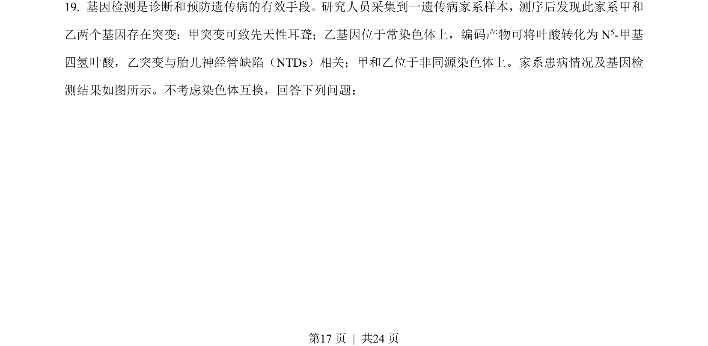
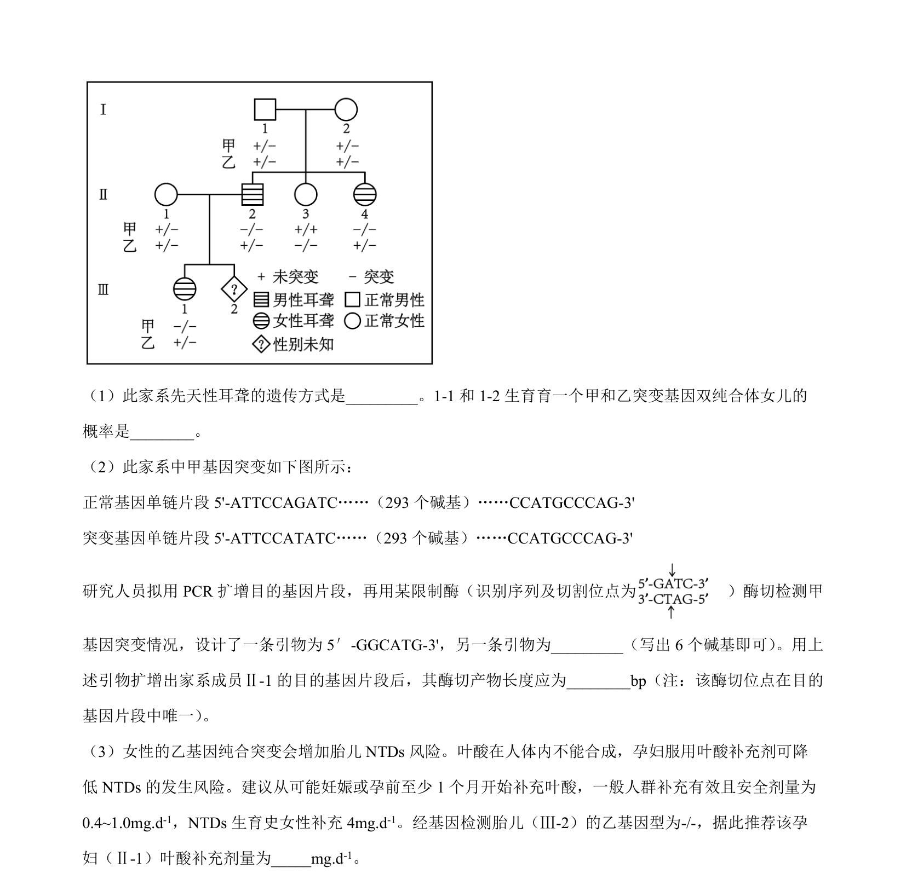
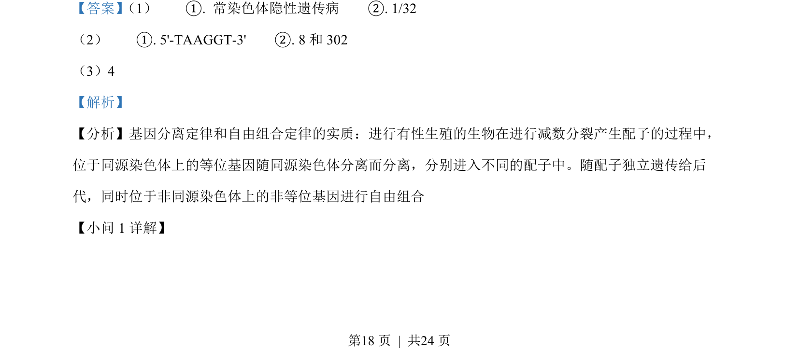
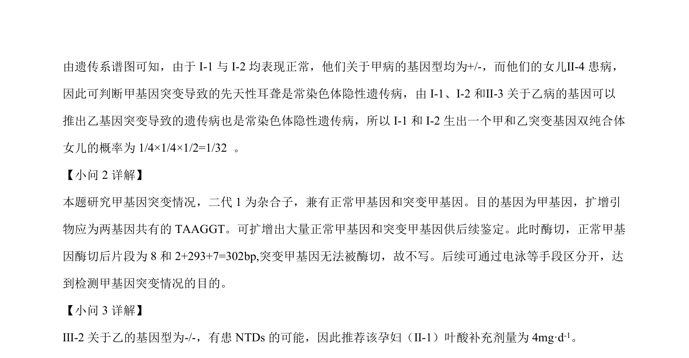

## 题面

## 摘要

遗传系谱图分析、遗传病概率计算、PCR/酶切鉴定及红豆杉种群密度调查与年龄结构分析

## 关联考点

- [[477-基因分离定律|基因分离定律]]
- [[272-自由组合定律|自由组合定律]]
- [[675-系谱分析|遗传系谱分析]]
- [[664-种群密度调查|种群密度调查]]

## 答案与解析

> 📄 原 PDF 第 17 页：`素材/真题/湖南/2008-2024·（湖南）生物高考真题/2023年高考生物试卷（湖南）（解析卷）.pdf`
