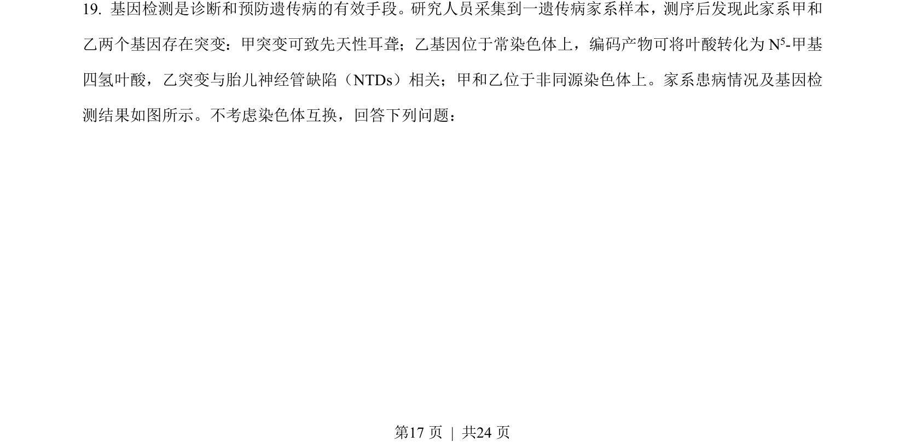
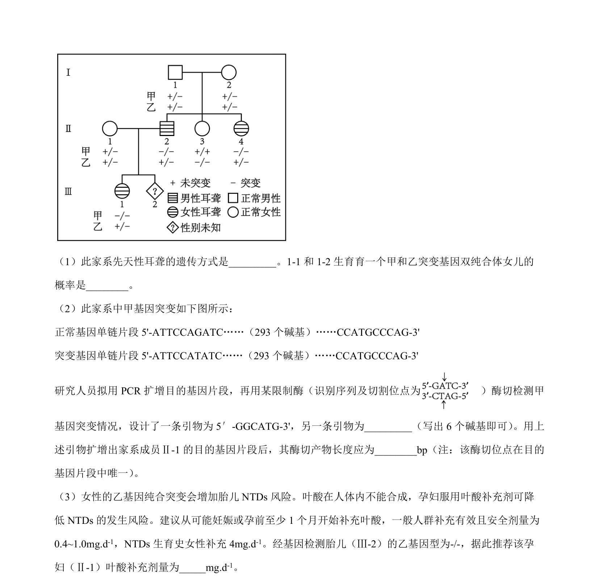
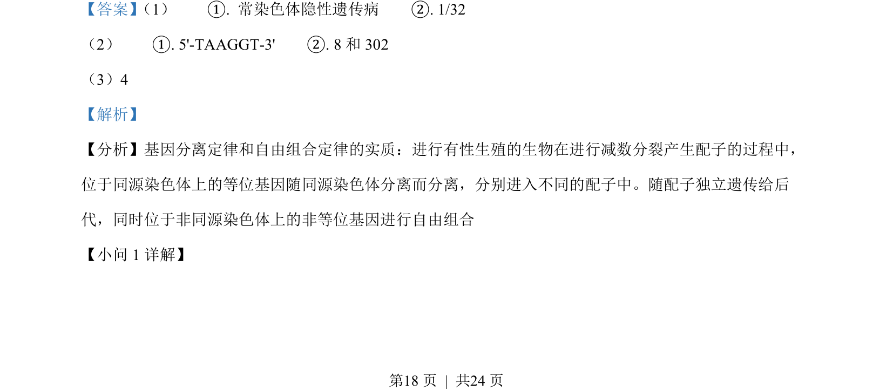
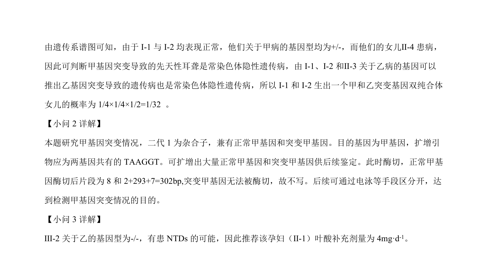

## 题面

## 摘要

遗传系谱图分析、遗传病概率计算、PCR/酶切鉴定及红豆杉种群密度调查与年龄结构分析

## 关联考点

- [[477-基因分离定律|基因分离定律]]
- [[272-自由组合定律|自由组合定律]]
- [[675-系谱分析|遗传系谱分析]]
- [[664-种群密度调查|种群密度调查]]

## 答案与解析

> 📄 原 PDF 第 17 页：`素材/真题/湖南/2008-2024·（湖南）生物高考真题/2023年高考生物试卷（湖南）（解析卷）.pdf`

<!-- 题干文本-start -->
## 题干文本
19. 基因检测是诊断和预防遗传病的有效手段。研究人员采集到一遗传病家系样本，测序后发现此家系甲和
乙两个基因存在突变：甲突变可致先天性耳聋；乙基因位于常染色体上，编码产物可将叶酸转化为N5-甲基
四氢叶酸，乙突变与胎儿神经管缺陷（NTDs）相关；甲和乙位于非同源染色体上。家系患病情况及基因检
测结果如图所示。不考虑染色体互换，回答下列问题：
。
<!-- 题干文本-end -->

<!-- 解析文本-start -->
## 解析文本

<!-- 解析文本-end -->
