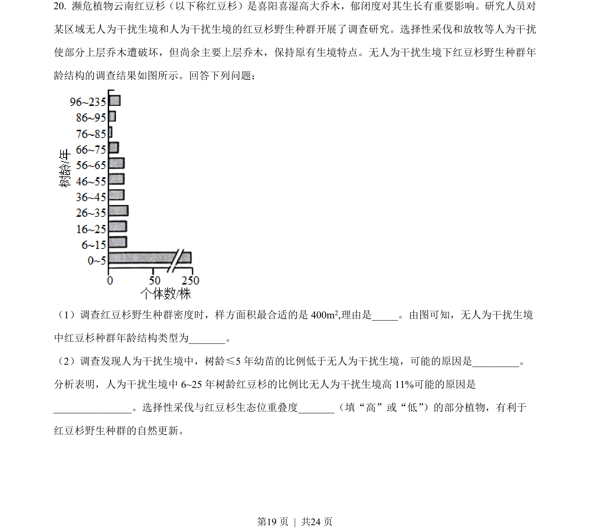
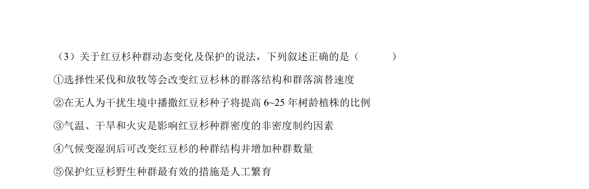
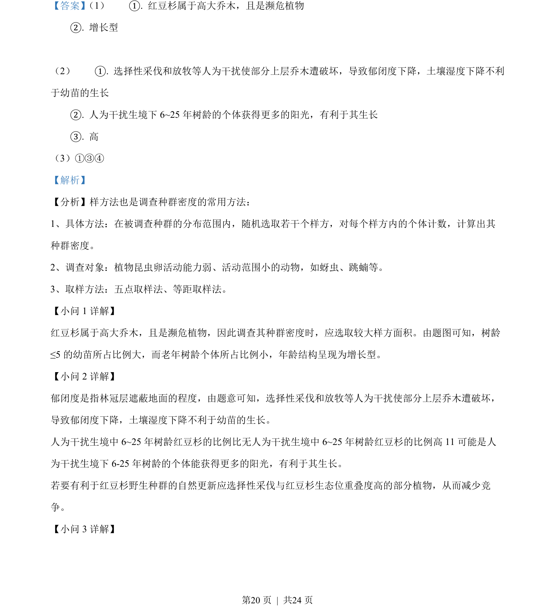
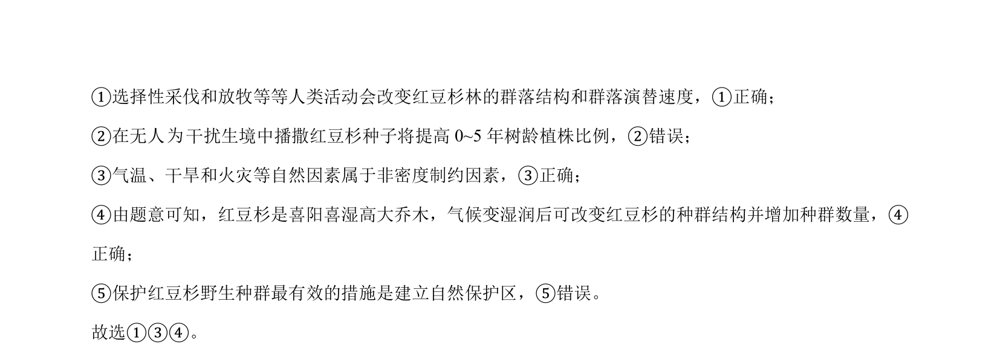

## 题面

## 摘要

本题综合考查种群密度调查、群落演替、微生物培养、基因工程及细胞培养等实验探究。

## 关联考点

- [[664-种群密度调查|种群密度调查]]
- [[869-群落结构|群落结构]]
- [[微生物筛选与培养]]
- [[411-基因工程|基因工程]]

## 答案与解析

> 📄 原 PDF 第 19 页：`素材/真题/湖南/2008-2024·（湖南）生物高考真题/2023年高考生物试卷（湖南）（解析卷）.pdf`
