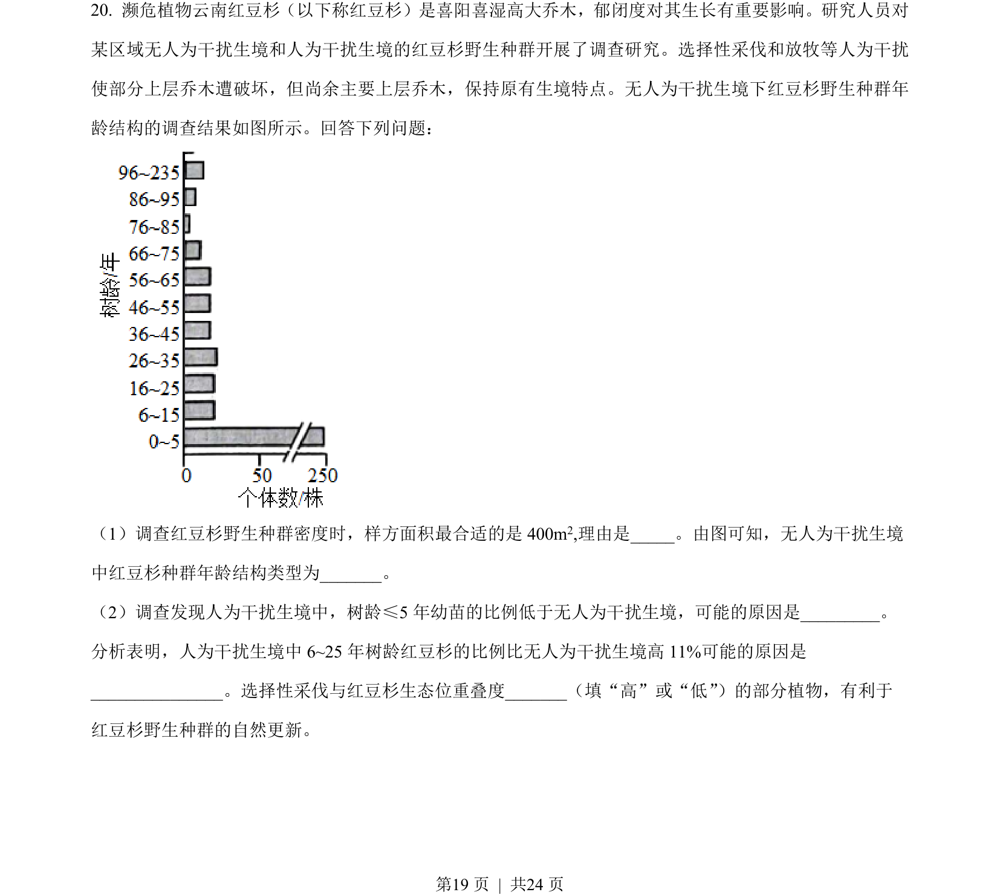
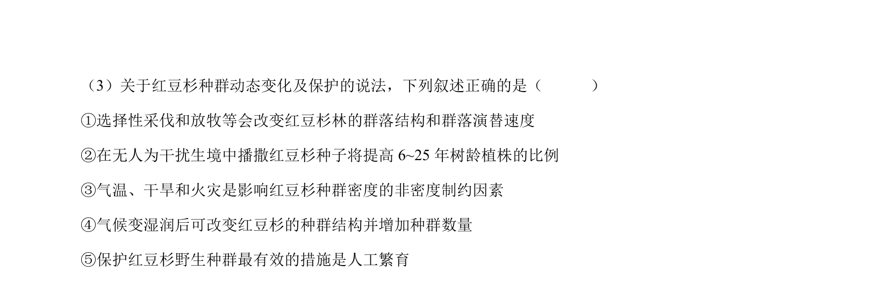
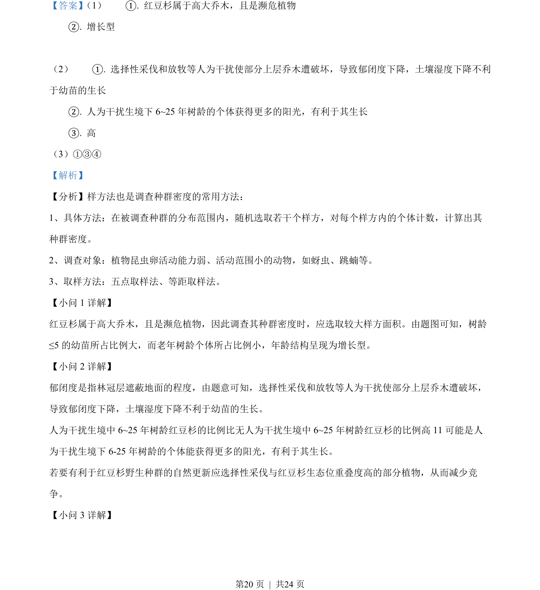
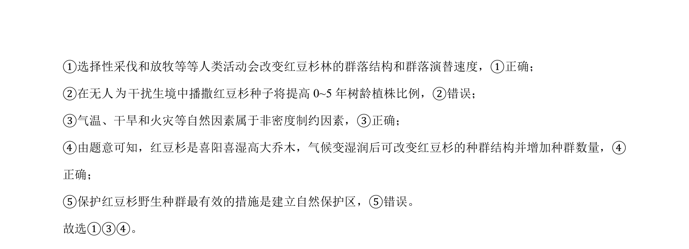

## 题面

## 摘要

本题综合考查种群密度调查、群落演替、微生物培养、基因工程及细胞培养等实验探究。

## 关联考点

- [[664-种群密度调查|种群密度调查]]
- [[868-群落的结构|群落结构]]
- [[微生物筛选与培养]]
- [[411-基因工程|基因工程]]

## 答案与解析

> 📄 原 PDF 第 19 页：`素材/真题/湖南/2008-2024·（湖南）生物高考真题/2023年高考生物试卷（湖南）（解析卷）.pdf`

<!-- 题干文本-start -->
## 题干文本
20. 濒危植物云南红豆杉（以下称红豆杉）是喜阳喜湿高大乔木，郁闭度对其生长有重要影响。研究人员对
某区域无人为干扰生境和人为干扰生境的红豆杉野生种群开展了调查研究。选择性采伐和放牧等人为干扰
使部分上层乔木遭破坏，但尚余主要上层乔木，保持原有生境特点。无人为干扰生境下红豆杉野生种群年
龄结构的调查结果如图所示。回答下列问题：
  
（1）调查红豆杉野生种群密度时，样方面积最合适的是 400m2,理由是_____。由图可知，无人为干扰生境
中红豆杉种群年龄结构类型为_______。
（2）调查发现人为干扰生境中，树龄≤5 年幼苗的比例低于无人为干扰生境，可能的原因是_________。
分析表明，人为干扰生境中 6~25 年树龄红豆杉的比例比无人为干扰生境高 11%可能的原因是
_______________。选择性采伐与红豆杉生态位重叠度_______（填“高”或“低”）的部分植物，有利于
红豆杉野生种群的自然更新。
<!-- 题干文本-end -->

<!-- 解析文本-start -->
## 解析文本

<!-- 解析文本-end -->
