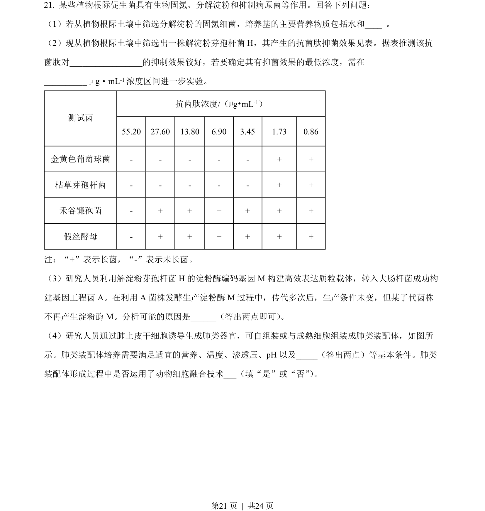
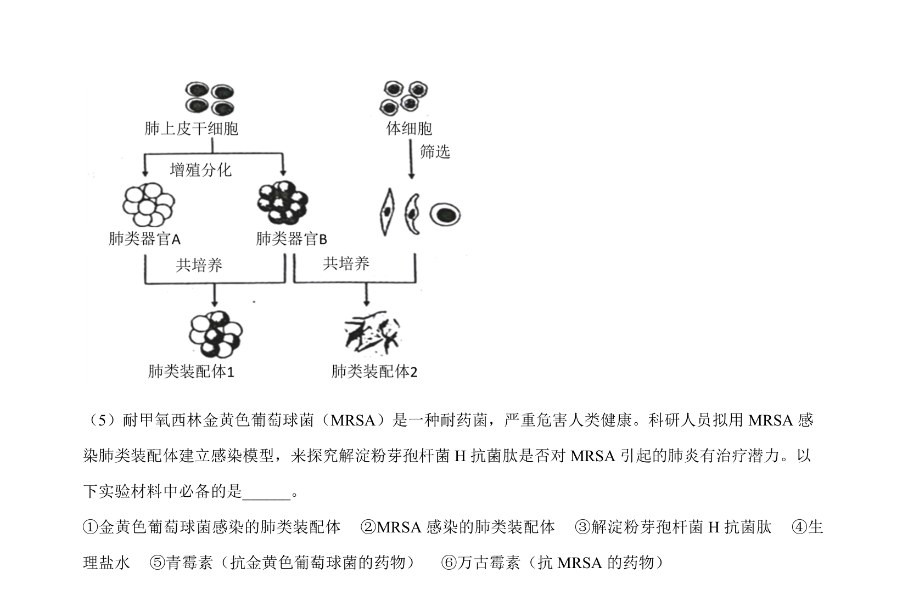
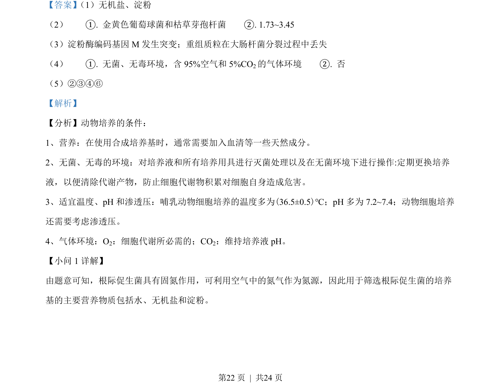
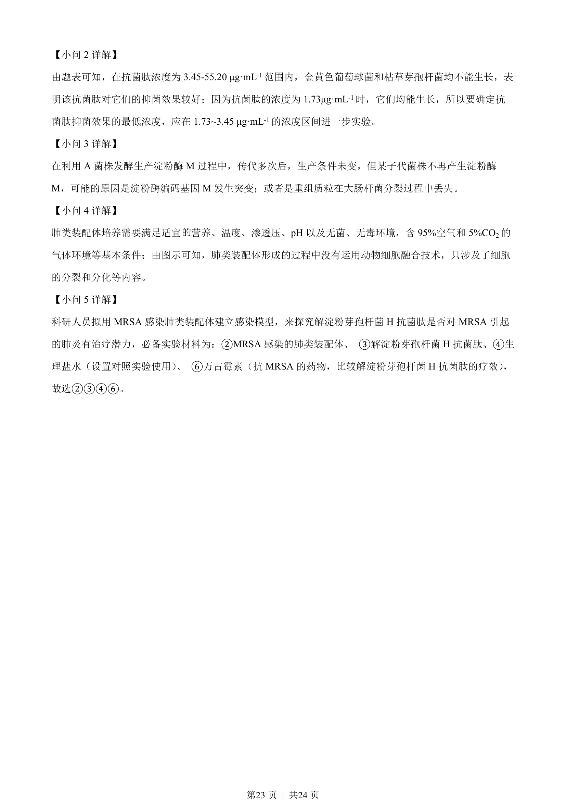

## 题面

## 摘要

本题考查微生物筛选、抗菌肽抑菌实验、基因突变及动物细胞培养等综合实验分析。

## 关联考点

- [[428-微生物培养|微生物培养]]
- [[抗菌肽抑菌]]
- [[动物细胞培养条件]]
- [[301-基因突变|基因突变]]

## 答案与解析

> 📄 原 PDF 第 21 页：`素材/真题/湖南/2008-2024·（湖南）生物高考真题/2023年高考生物试卷（湖南）（解析卷）.pdf`
