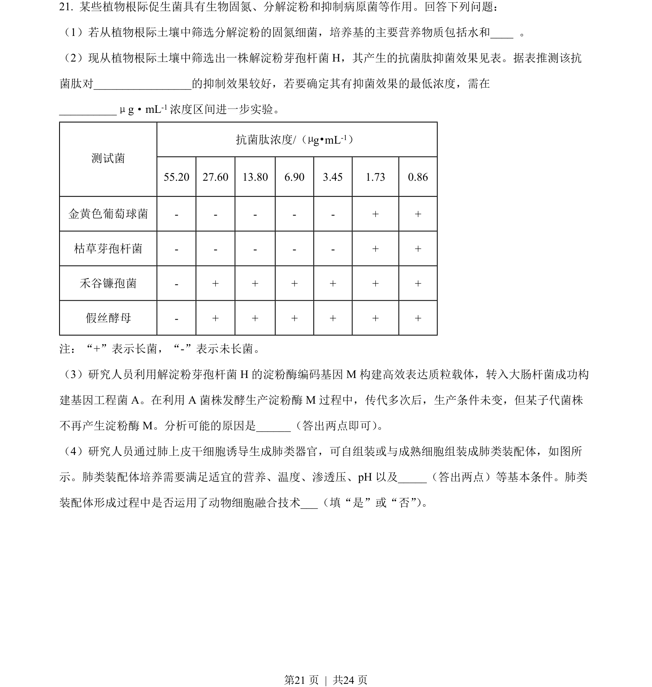
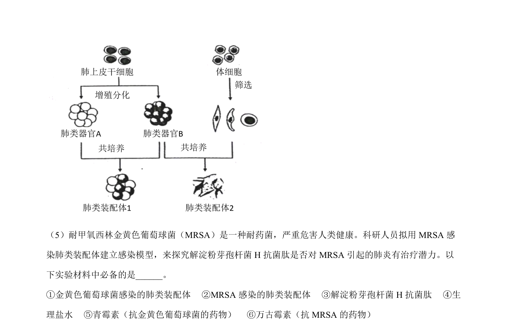
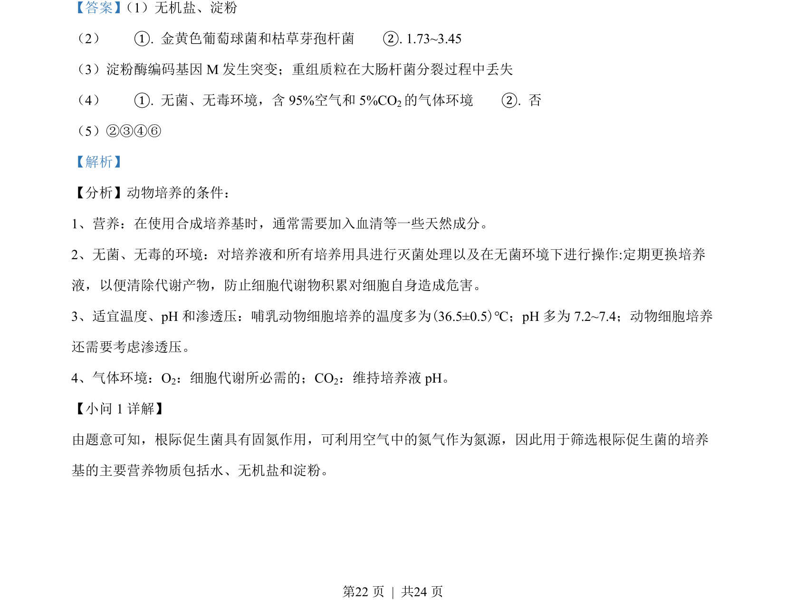
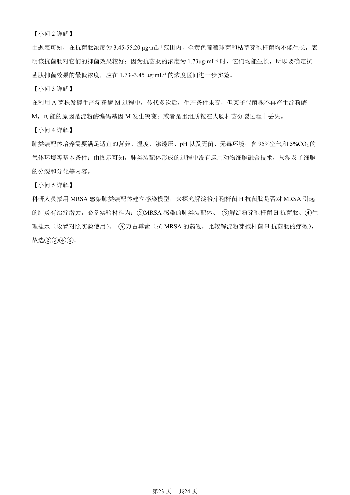

## 题面

## 摘要

本题考查微生物筛选、抗菌肽抑菌实验、基因突变及动物细胞培养等综合实验分析。

## 关联考点

- [[428-微生物培养|微生物培养]]
- [[抗菌肽抑菌]]
- [[动物细胞培养条件]]
- [[301-基因突变|基因突变]]

## 答案与解析

> 📄 原 PDF 第 21 页：`素材/真题/湖南/2008-2024·（湖南）生物高考真题/2023年高考生物试卷（湖南）（解析卷）.pdf`

<!-- 题干文本-start -->
## 题干文本
21. 某些植物根际促生菌具有生物固氮、分解淀粉和抑制病原菌等作用。回答下列问题：
（1）若从植物根际土壤中筛选分解淀粉的固氮细菌，培养基的主要营养物质包括水和____ 。
（2）现从植物根际土壤中筛选出一株解淀粉芽孢杆菌 H，其产生的抗菌肽抑菌效果见表。据表推测该抗
菌肽对_________________的抑制效果较好，若要确定其有抑菌效果的最低浓度，需在
__________μg·mL-1浓度区间进一步实验。
抗菌肽浓度/（µg•mL-1）
测试菌
55.20 27.60 13.80 6.90 3.45 1.73 0.86
金黄色葡萄球菌 - - - - - + +
枯草芽孢杆菌 - - - - - + +
禾谷镰孢菌 - + + + + + +
假丝酵母 - + + + + + +
注：“+”表示长菌，“-”表示未长菌。
（3）研究人员利用解淀粉芽孢杆菌 H 的淀粉酶编码基因 M 构建高效表达质粒载体，转入大肠杆菌成功构
建基因工程菌 A。在利用 A 菌株发酵生产淀粉酶 M 过程中，传代多次后，生产条件未变，但某子代菌株
不再产生淀粉酶 M。分析可能的原因是______（答出两点即可） 。
（4）研究人员通过肺上皮干细胞诱导生成肺类器官，可自组装或与成熟细胞组装成肺类装配体，如图所
示。肺类装配体培养需要满足适宜的营养、温度、渗透压、pH 以及_____（答出两点）等基本条件。肺类
装配体形成过程中是否运用了动物细胞融合技术___（填“是”或“否”） 。
为
<!-- 题干文本-end -->

<!-- 解析文本-start -->
## 解析文本

<!-- 解析文本-end -->
