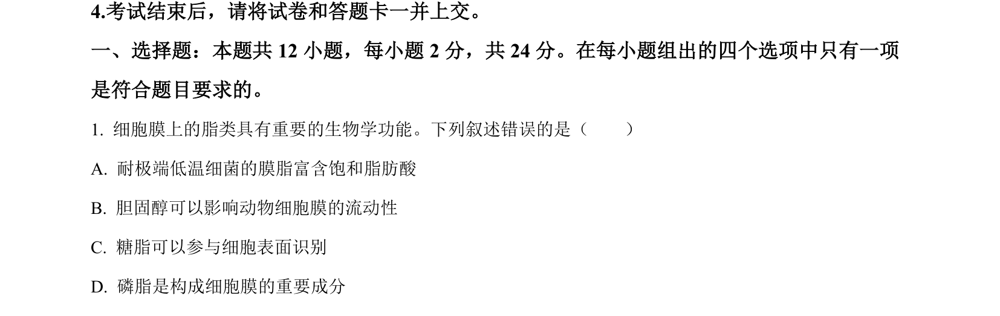
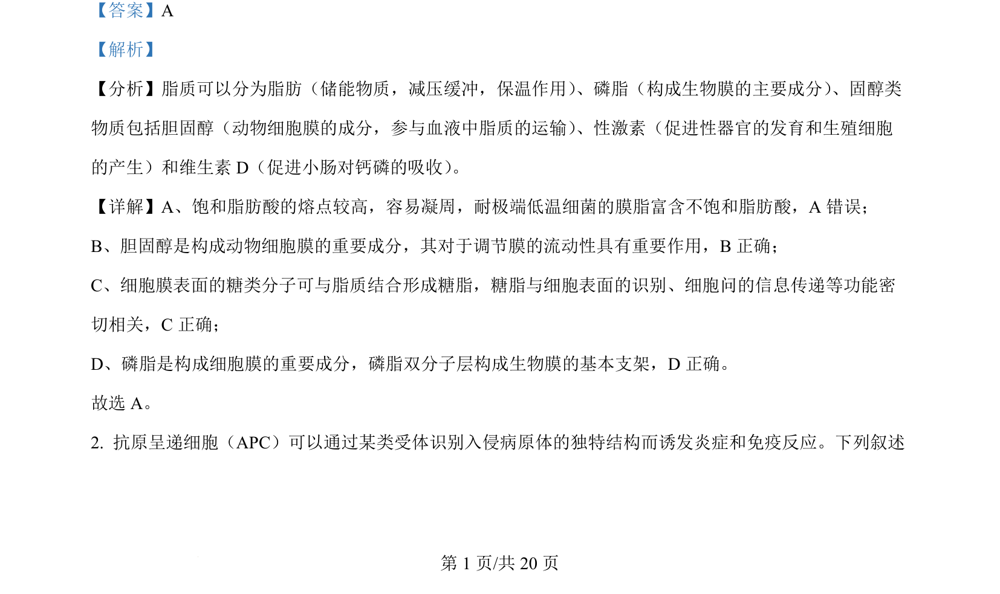
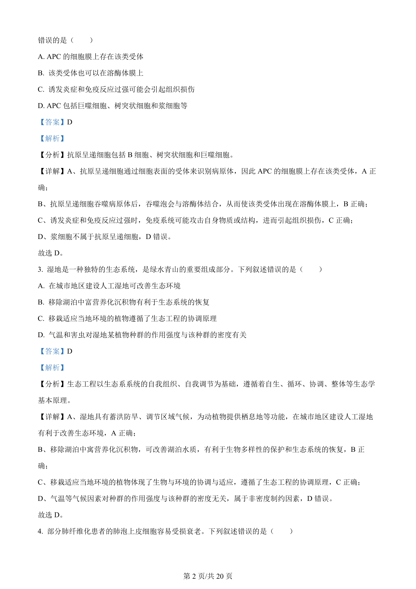
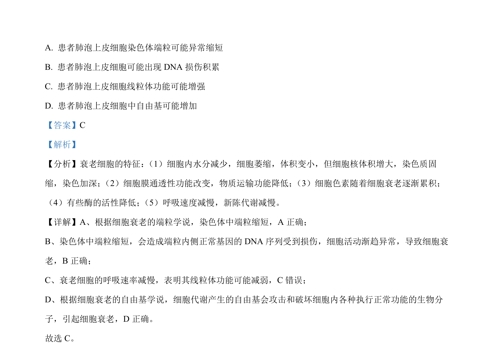

## 题面

## 摘要

考查细胞衰老的特征、端粒学说和自由基学说，判断各选项的正误。

## 关联考点

- [[254-细胞衰老|细胞衰老]]
- [[端粒学说]]
- [[自由基学说]]
- [[883-线粒体功能|线粒体功能]]

## 答案与解析

> 📄 原 PDF 第 1 页：`素材/真题/湖南/2008-2024·（湖南）生物高考真题/2024年高考生物试卷（湖南）（解析卷）.pdf`
