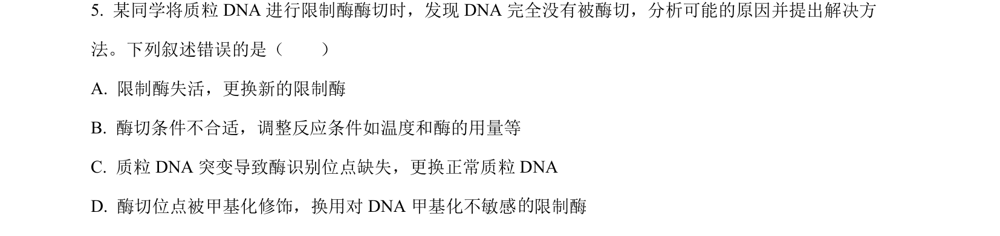
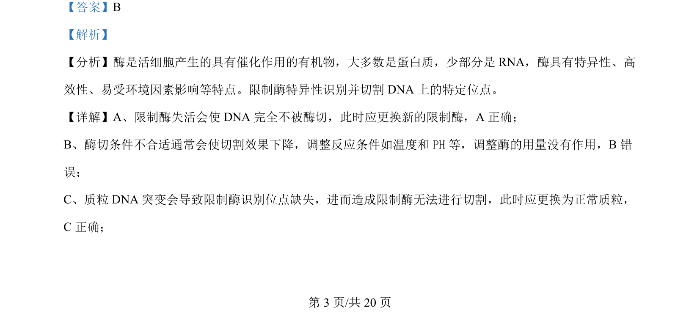
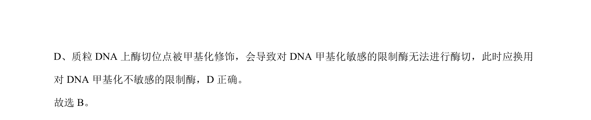

## 题面

## 摘要

本题考查限制酶的特性和酶切实验中常见问题的原因分析。

## 关联考点

- [[422-限制性核酸内切酶|限制酶]]
- [[243-酶的特性|酶的特性]]
- [[525-DNA甲基化|DNA甲基化]]
- [[酶切实验]]

## 答案与解析

> 📄 原 PDF 第 3 页：`素材/真题/湖南/2008-2024·（湖南）生物高考真题/2024年高考生物试卷（湖南）（解析卷）.pdf`
