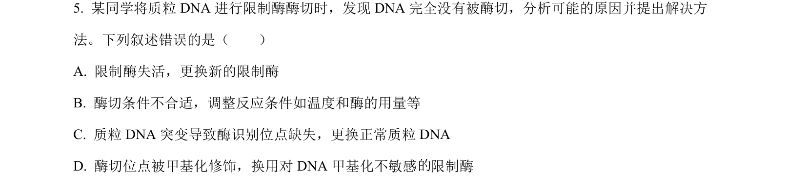
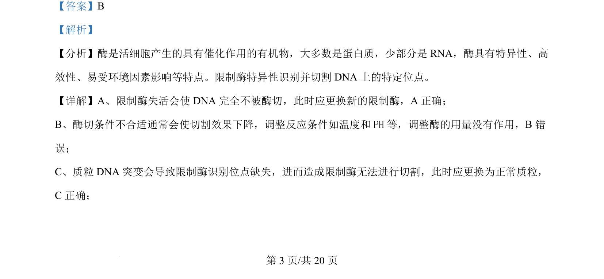
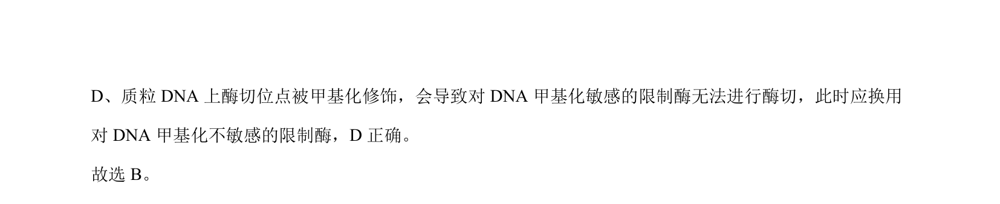

## 题面

## 摘要

本题考查限制酶的特性和酶切实验中常见问题的原因分析。

## 关联考点

- [[422-限制性核酸内切酶|限制酶]]
- [[243-酶的特性|酶的特性]]
- [[525-DNA甲基化|DNA甲基化]]
- [[酶切实验]]

## 答案与解析

> 📄 原 PDF 第 3 页：`素材/真题/湖南/2008-2024·（湖南）生物高考真题/2024年高考生物试卷（湖南）（解析卷）.pdf`

<!-- 题干文本-start -->
## 题干文本
5. 某同学将质粒 DNA 进行限制酶酶切时，发现 DNA 完全没有被酶切，分析可能的原因并提出解决方
法。下列叙述错误的是（　　）
A. 限制酶失活，更换新的限制酶
B. 酶切条件不合适，调整反应条件如温度和酶的用量等
C. 质粒 DNA 突变导致酶识别位点缺失，更换正常质粒 DNA
D. 酶切位点被甲基化修饰，换用对 DNA 甲基化不敏感 限制酶
<!-- 题干文本-end -->

<!-- 解析文本-start -->
## 解析文本
【答案】B
【解析】
【分析】酶是活细胞产生的具有催化作用的有机物，大多数是蛋白质，少部分是 RNA，酶具有特异性、高
效性、易受环境因素影响等特点。限制酶特异性识别并切割 DNA 上的特定位点。
【详解】A、限制酶失活会使 DNA 完全不被酶切，此时应更换新的限制酶，A 正确；
B、酶切条件不合适通常会使切割效果下降，调整反应条件如温度和PH等，调整酶的用量没有作用， B错
误；
C、质粒 DNA 突变会导致限制酶识别位点缺失，进而造成限制酶无法进行切割，此时应更换为正常质粒，
C正确；
的
<!-- 解析文本-end -->
