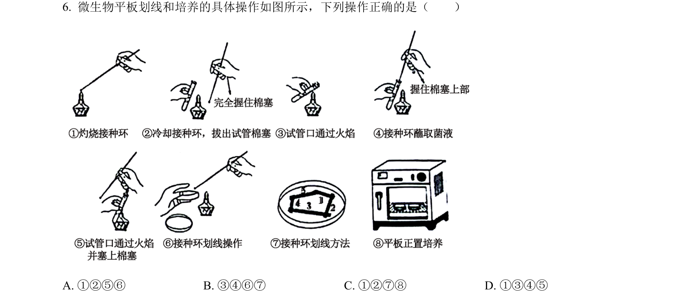
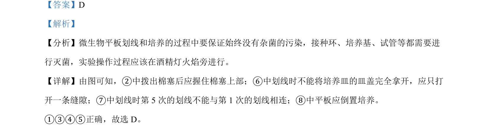

## 题面

## 摘要

考查微生物平板划线操作要点及噬菌体治疗的原理。

## 关联考点

- [[428-微生物培养|微生物培养]]
- [[594-平板划线法|平板划线法]]
- [[噬菌体侵染]]
- [[308-共同进化|协同进化]]

## 答案与解析

> 📄 原 PDF 第 4 页：`素材/真题/湖南/2008-2024·（湖南）生物高考真题/2024年高考生物试卷（湖南）（解析卷）.pdf`
